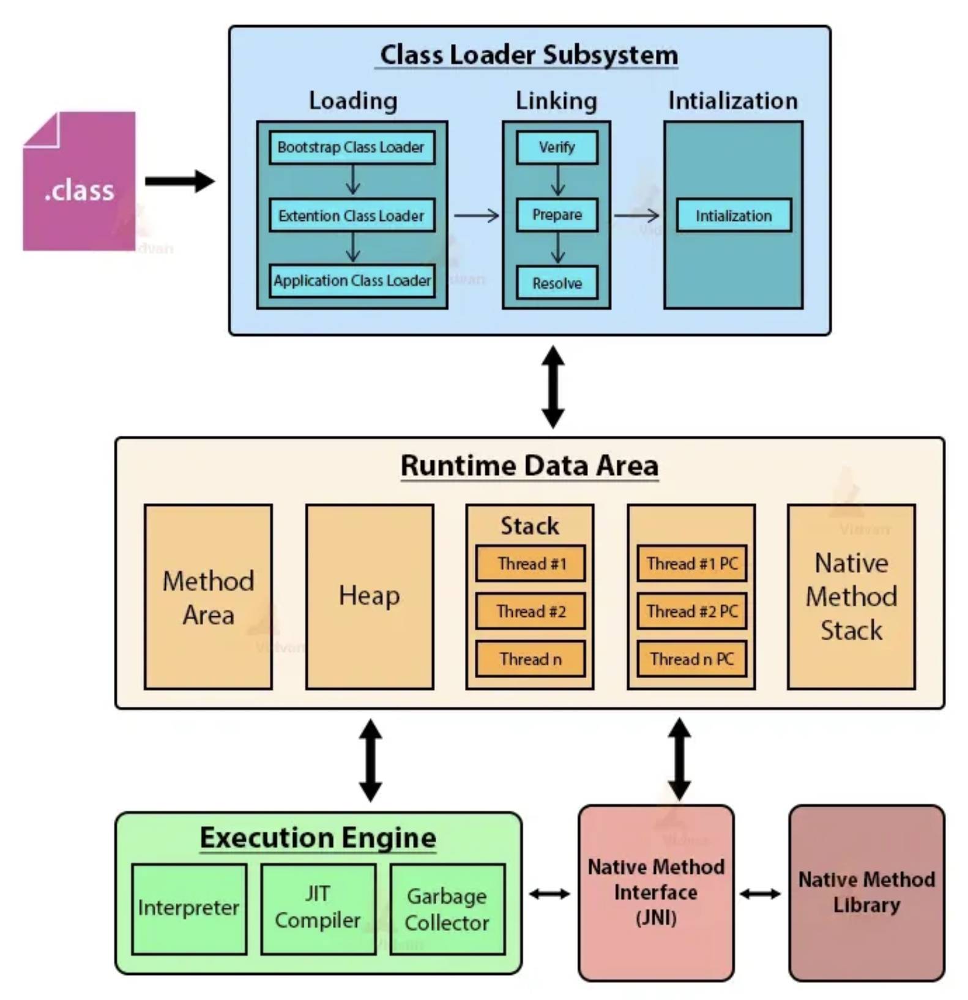
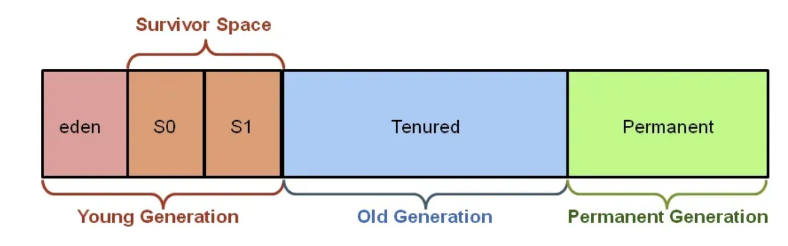

# JVM(Java Virtual Machine)

- **자바 가상 머신(Java Virtual Machine, JVM)은 자원을 관리하면서 자바 기반 애플리케이션 실행 환경 제공(Runtime Environment)**
- 한 번 작성해 어디에서나 실행(어느 기기, 또는 어느 운영체제 상에서도 실행될 수 있는 것)
- 자바는 컴파일 시에 Java Byte Code로 컴파일되며, JVM에서 바이트 코드를 실행. JVM은 바이트 코드를 실행할 때 인터프리터와 JIT(Just-In-Time) 컴파일러를 모두 사용

## JVM 구조



- **JVM 메모리 영역(Runtime Data Area)**
    - **JVM이 운영체제로부터 할당 받은 메모리 영역**. class Loader가 준비한 데이터들이 보관되는 장소
    - 아래 영역으로 세분된다.
        - Method Area: 클래스 수준 정보를 저장하는 공유 영역. (클래스 로더 참조, 런타임 상수 풀, 생성자 필드 함수 데이터)
        - Heap Area: 모든 객체와 인스턴스를 저장하는 영역
        - Stack Area: 후입선출 구조로 함수가 실행이 완료되면 삭제. 로컬 변수 저장. 스레드별로 저장 공간 있음.
        - Program Counter(PC): 실행 중인 현재 명령 기록. 현재 명령어를 가리키는 포인터와 유사. 명령어가 실행되면 다음 명령어를 가리킴
        - Native Method Stack: C, C++로 구현된 자바 메소드 실행 스택이 저장되는 영역
- **가비지 컬렉터(Garbage Collector)**
    - **애플리케이션이 생성한 객체의 사용 여부를 판단하여 사용되지 않는다면 객체를 해제하여 메모리를 자동으로 관리**
- **클래스 로더(Class Loader)**
    - 자바 클래스 로더는 **클래스를 메모리에 로드**, 다음 세 가지 단계로 구성
        1. **로딩(Loading)**: JVM이 클래스 파일을 하나씩 읽으며 메모리에 올림 (클래스가 JVM에 로드되면 클래스 유형의 객체가 생성되어 힙 영역에 배치, JVM에 처음 로드될 때만 객체 생성)
        2. **링킹(Linking):** 클래스 파일에 있는 데이터를 메모리 영역에 연결하는 과정. 링킹은 아래와 같은 과정을 거쳐 Java 파일을 메모리 영역에 로드한다.
            1. 검증(Verification): 클래스 파일이 유효한지 검증
            2. 준비(Preparation): 클래스 변수들을 기본 값으로 초기화
            3. 해결(Resolution): 심볼릭 주소를 실제 메모리 주소로 변환
        3. **초기화(Initialization)**: 모든 static 변수와 instance 변수에 실제 값을 할당. 클래스는 다음 경우 초기화
            - `new` 키워드를 사용하여 객체를 생성할 때
            - Reflection API에서 `getInstance()`를 호출할 때
            - 클래스의 초기화 블록이 실행될 때
            - Clone()으로 객체를 복사할 때
            - static 메서드를 호출할 때
            - static 필드에 값을 할당할 때
            - 서브클래스를 인스턴스화할 때
            - 직렬화된 데이터를 역직렬화할 때
    - 일반적으로 세 가지 클래스 로더가 존재
        - **부트스트랩 클래스 로더**: 핵심 Java API 클래스를 로드 (신뢰할 수 있는 클래스)
        - **확장 클래스 로더**: 부트스트랩 클래스 로더의 하위 클래스 로드
        - **시스템 클래스 로더:** 애플리케이션 클래스 경로에서 클래스 로드
- **실행 엔진(Execution Engine)**
    - 클래스 로더가 클래스를 로딩하는 작업을 마치면, **JVM 구성요소인 실행 엔진은 바이트 코드를 실행**
    - 실행 엔진은 메모리 할당, 파일 시스템 접근, 네트워크 입출력 등을 위한 자원을 관리
    - 실행 엔진에는 다음 두 가지 중요 구성 요소가 존재
        - **Interpreter**: 바이트 코드를 한 줄씩 읽고 실행. 이 방식은 초기 시작이 빠르지만 실행 속도가 느릴 수 있음
        - **JIT Compiler**: 실행 중 일부 바이트 코드의 성능을 최적화하기 위해 기계어로 변환하여 실행. 이 방식은 초기 시작은 느릴 수 있지만, 반복적으로 실행되는 코드의 성능을 크게 향상.
- **네이티브 메소드 영역(Native Method Area)**
    - C, C++로 구현된 Java 메소드가 저장되는 영역

# 가비지 컬렉터(Garbage Collector)

- JVM이 실행을 시작하기 전에 모든 객체는 힙 영역에 저장되고, 힙 메모리에서 사용되지 않은 객체는 자동으로 제거하여 메모리 관리
- 가비지 컬렉터 힙 메모리 구조
  
 
    - **Young Generation**: 새로 생성된 객체들이 저장되는 공간
        - Eden Space**:** 대부분의 객체가 처음 생성되는 곳
        - Survivor Space (S0, S1)**:** Eden에서 살아남은 객체들이 이동되는 두 개의 영역
    - **Old Generation**: Young Generation에서 일정 시간 참조되고 살아남은 객체들이 저장되는 영역
    - **Metaspace(Permanent Generation)**: 클래스 메타데이터, 상수, 메서드 정보 등을 저장하는 영역
- 유형
    - **minor Garbage Collection(가벼운 쓰레기 수거)**
        - 새로 생성된 객체들 중 더 이상 참조되지 않는 객체를 제거 (Young Generation)
    - **major Garbage Collection(주요 쓰레기 수거)**
        - Young Generation을 거쳐 살아남은 객체 중 더 이상 참조되지 않는 객체를 제거 (Old Generation, Permanent Generation)
        - Young Generation보다 덜 자주 발생하지만, 발생할 때는 더 많은 시간을 소요
- **가비지 컬렉션 대상**
    - 참조가 널을 가리키는 경우
    - 참조가 다른 객체를 가리키는 경우
    - 메소드 내부에 생성된 객체
    - 서로가 서로를 참조하지만 외부에서 참조되지 않는 객체 (Island of Isolation)
- **JVM에 garbage collector 실행 요청하기**
    - `System.gc()`
    - `Runtime.getRuntime().gc()`
    - 두 방법 중 어느것도 가비지 컬렉터를 실행할 것이란 보장은 없다. (JVM의 가비지 컬렉터는 자체 최적화 알고리즘에 따라 가비지 컬렉션을 수행하도록 설계)

# 질문

## Q1. JVM이란?

> 자바 가상 머신(Java Virtual Machine, JVM)은 자원을 관리하면서 자바 기반 애플리케이션 실행 환경 제공(Runtime Environment)

## Q2. JVM 구조에 대해 설명해 주세요.

> JVM 메모리 영역(Runtime Data Area), 가비지 컬렉터(Garbage Collector), 클래스 로더(Class Loader), 실행 엔진(Execution Engine), 네이티브 메소드 영역(Native Method Area)으로 구성

## Q3. JVM 메모리 영역에 대해 설명해 주세요.

> JVM이 운영체제로부터 할당 받은 메모리 영역. class Loader가 준비한 데이터들이 보관되는 장소

> **Method Area**: 클래스 수준 정보를 저장하는 공유 영역. (클래스 로더 참조, 런타임 상수 풀, 생성자 필드 함수 데이터)

> **Heap Area**: 모든 객체와 인스턴스를 저장하는 영역

> **Stack Area**: 후입선출 구조로 함수가 실행이 완료되면 삭제. 로컬 변수 저장. 스레드별로 저장 공간 있음.

> **Program Counter(PC)**: 실행 중인 현재 명령 기록. 현재 명령어를 가리키는 포인터와 유사. 명령어가 실행되면 다음 명령어를 가리킴

> **Native Method Stack**: C, C++로 구현된 자바 메소드 실행 스택이 저장되는 영역

## Q4. JVM 클래스 로더에 대해 설명해 주세요

> 자바 클래스 로더는 클래스를 메모리에 로드, 다음 세 가지 단계로 구성

> **로딩(Loading)**: JVM이 클래스 파일을 하나씩 읽으며 메모리에 올림 (클래스가 JVM에 로드되면 클래스 유형의 객체가 생성되어 힙 영역에 배치, JVM에 처음 로드될 때만 객체 생성)

> **링킹(Linking)**: 클래스 파일에 있는 데이터를 메모리 영역에 연결하는 과정. 링킹은 아래와 같은 과정을 거쳐 Java 파일을 메모리 영역에 로드한다.
> 1. 검증(Verification): 클래스 파일이 유효한지 검증
> 2. 준비(Preparation): 클래스 변수들을 기본 값으로 초기화
> 3. 해결(Resolution): 심볼릭 주소를 실제 메모리 주소로 변환

> **초기화(Initialization)**: 모든 static 변수와 instance 변수에 실제 값을 할당. 클래스는 다음 경우 초기화
> 1. `new` 키워드를 사용하여 객체를 생성할 때
> 2. Reflection API에서 `getInstance()`를 호출할 때
> 3. 클래스의 초기화 블록이 실행될 때

## Q5. JVM 실행 엔진에 대해 설명해 주세요.

> 클래스 로더가 클래스를 로딩하는 작업을 마치면, JVM 구성요소인 실행 엔진은 바이트 코드를 실행

> 실행 엔진은 메모리 할당, 파일 시스템 접근, 네트워크 입출력 등을 위한 자원을 관리
> 실행 엔진에는 다음 두 가지 중요 구성 요소가 존재
> 1. Interpreter: 바이트 코드를 한 줄씩 읽고 실행. 이 방식은 초기 시작이 빠르지만 실행 속도가 느릴 수 있음
> 2. JIT Compiler: 실행 중 일부 바이트 코드의 성능을 최적화하기 위해 기계어로 변환하여 실행. 이 방식은 초기 시작은 느릴 수 있지만, 반복적으로 실행되는 코드의 성능을 크게 향상.

## Q6. 가비지 컬렉터란 무엇이고, 가비지 컬렉터의 대상이 되는 것은 무엇이 있나요?

> 가비지 컬렉터란 힙 메모리에서 사용되지 않은 객체는 자동으로 제거하여 메모리 관리, 가비지 컬렉션 대상에는 참조가 널을 가리키는 경우, 참조가 다른 객체를 가리키는 경우, 메소드 내부에 생성된 객체, 서로가 서로를 참조하지만 외부에서 참조되지 않는 객체 (Island of Isolation)

## Q7. 가비지 컬렉터 힙 메모리 구조와 동작 과정에 대해 설명하시오.

> **Young Generation**: 새로 생성된 객체들이 저장되는 공간
> 1. Eden Space**:** 대부분의 객체가 처음 생성되는 곳
> 2. Survivor Space (S0, S1)**:** Eden에서 살아남은 객체들이 이동되는 두 개의 영역

> **Old Generation**: Young Generation에서 일정 시간 참조되고 살아남은 객체들이 저장되는 영역

> **Metaspace(Permanent Generation)**: 클래스 메타데이터, 상수, 메서드 정보 등을 저장하는 영역 

> **Mark:** GC는 루트(root) 객체에서 시작하여 도달 가능한 모든 객체를 탐색하고 마킹(marking). 이 단계에서 살아있는 객체와 그렇지 않은 객체를 식별
> **Sweep:** 마킹되지 않은 객체는 메모리에서 제거
> **Compact:** 메모리 단편화를 방지하기 위해 살아있는 객체들을 한쪽으로 모아서 연속적인 공간을 확보

## Q8. 아래 코드가 실행될 때 JVM 메모리에서 어떤 일이 일어나는지 설명해 주세요.

```java
public static void main(String[] args){
    System.out.println("Hello world");
}
```

> JVM은 main 클래스를 찾아 로드. 이 과정에서 클래스의 바이트 코드를 읽고 메모리에 로드, System 클래스 로드

>  Method Area에 System 클래스의 메타 데이터 저장

> “Hello World” 문자열 리터럴은 힙 영역에 저장, System.out 객체는 힙 영역에 저장

>  main 함수 호출 스택은 스택 영역에 저장, 현재 실행 중인 명령어를 PC에 저장. 출력이 완료되면 스택 영역에서 메인 함수 스택 프레임 팝되어 사라짐

## Q9. 자바 컴파일 과정에 대해 설명해 주세요.

> 자바 컴파일러가 컴파일 → 바이트 코드 생성(.class)
> JVM 클래스 로더가 클래스 파일을 메모리에 로드
> JVM 실행 엔진이 바이트 코드 실행(실행 엔진은 인터프리터와 JIT 컴파일러 사용)

## Q10. 어떻게 JIT Compiler는 JVM 성능을 향상시켰나요?

> JVM의 실행 엔진의 일부로, 바이트코드를 실행할 때 인터프리터 방식 대신 자주 실행되는 바이트코드를 네이티브 머신 코드로 변환하여 성능을 향상시키는 역할 

**> 동적 컴파일:** 자주 호출되는 메서드나 루프 등을 네이티브 코드로 컴파일하여 실행 속도 향상

**> 런타임 최적화:** 실행 중에 수집된 프로파일링 정보를 사용하여 최적화된 네이티브 코드를 생성

**> 캐싱:** 컴파일된 네이티브 코드는 캐시에 저장되어 이후에 다시 사용 가능 (속도 향상)

# 참고 자료

- https://github.com/ksundong/backend-interview-question
- https://www.geeksforgeeks.org/garbage-collection-java/
- https://www.geeksforgeeks.org/jvm-works-jvm-architecture/
- [https://github.com/WooVictory/Ready-For-Tech-Interview/blob/master/Java/[Java] JVM.md](https://github.com/WooVictory/Ready-For-Tech-Interview/blob/master/Java/%5BJava%5D%20JVM.md)
- https://medium.com/@khurshidbek-bakhromjonov/java-memory-management-understanding-the-jvm-heap-method-area-stack-24a4d4fa2363