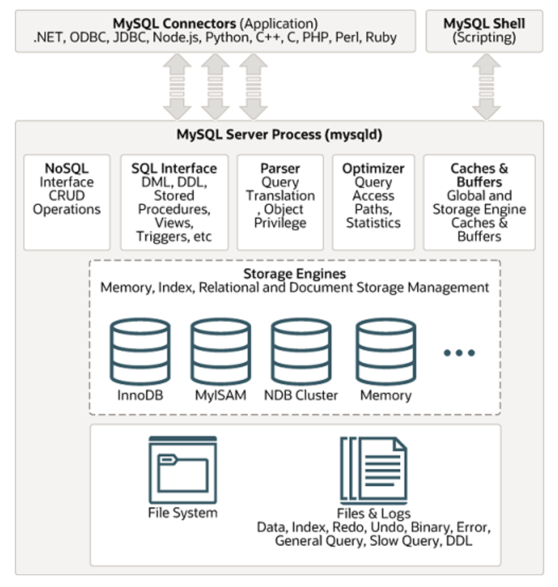
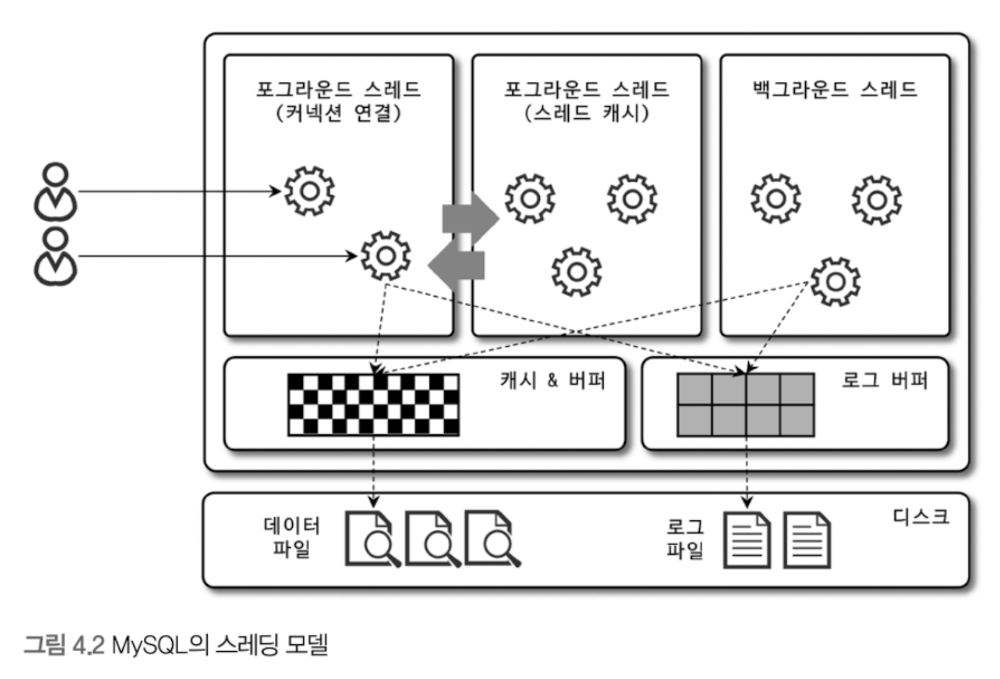
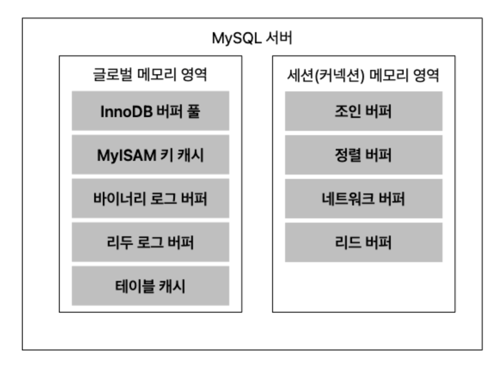
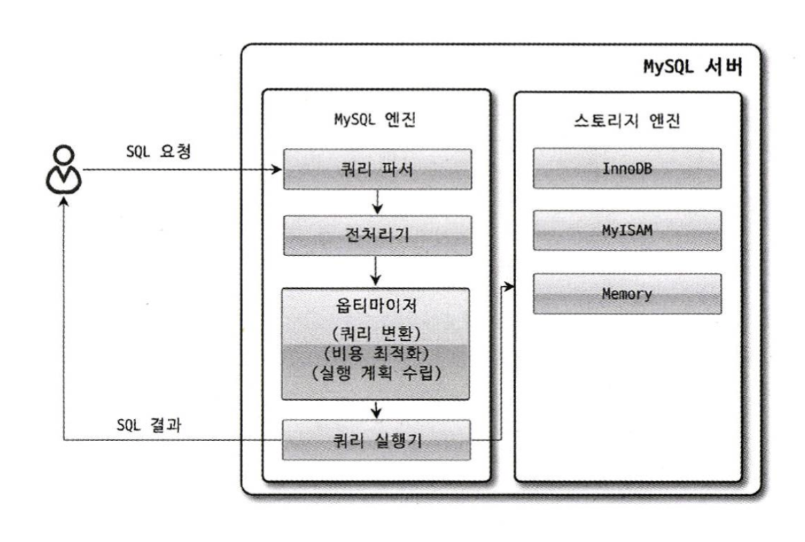
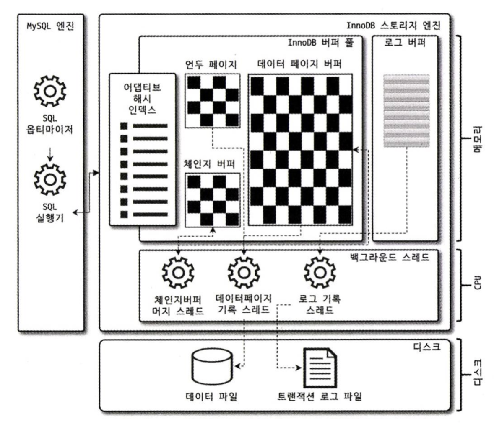
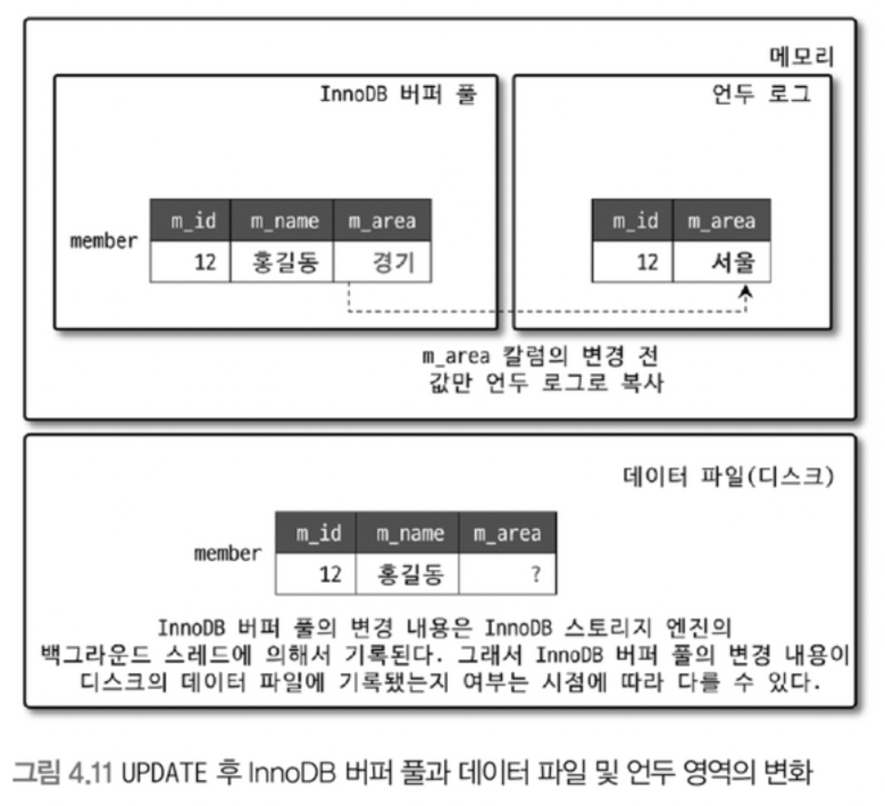

- [MySQL 전체 구조](#mysql-전체-구조)
  - [구성 요소](#구성-요소)
    - [1. MySQL 엔진](#1-mysql-엔진)
    - [2. 스토리지 엔진](#2-스토리지-엔진)
    - [3. 운영체제 하드웨어(데이터 파일, 로그 파일)](#3-운영체제-하드웨어데이터-파일-로그-파일)
  - [MySQL 스레딩 구조](#mysql-스레딩-구조)
    - [포그라운드 스레드](#포그라운드-스레드)
    - [백그라운드 스레드](#백그라운드-스레드)
  - [메모리 할당 및 사용 구조](#메모리-할당-및-사용-구조)
    - [글로벌 메모리 영역](#글로벌-메모리-영역)
    - [로컬 메모리 영역](#로컬-메모리-영역)
  - [쿼리 실행 구조](#쿼리-실행-구조)
    - [1. 쿼리 파서](#1-쿼리-파서)
    - [2. 전처리기](#2-전처리기)
    - [3. 옵티마이저](#3-옵티마이저)
    - [4. 실행 엔진](#4-실행-엔진)
  - [InnoDB 엔진 아키텍처](#innodb-엔진-아키텍처)
    - [기본 키에 의한 클러스터링](#기본-키에-의한-클러스터링)
    - [외래 키 지원](#외래-키-지원)
    - [MVCC(Multi Version Concurrency Control)](#mvccmulti-version-concurrency-control)
    - [자동 데드락 감지](#자동-데드락-감지)
    - [InnoDB 버퍼 풀](#innodb-버퍼-풀)
    - [언두 로그](#언두-로그)
    - [리두 로그 및 리두 버퍼](#리두-로그-및-리두-버퍼)
    - [어댑티브 해시 인덱스](#어댑티브-해시-인덱스)
- [참고자료](#참고자료)

# MySQL 전체 구조

## 구성 요소
- MySQL 서버는 크게 **MySQL 엔진과 스토리지 엔진으로 구분**한다.
### 1. MySQL 엔진
- **클라이언트로부터 접속 및 쿼리 요청을 처리하는 커넥션 핸들러**와 **SQL 파서 및 전처리기, 쿼리의 최적화된 실행을 위한 옵티마이저가 중심**이 된다.
- 커넥션 핸들러, SQL 인터페이스, SQL 파서, SQL 옵티마이저, 실행 엔진, 캐시 & 버퍼
- MySQL 엔진의 쿼리 실행기에서 데이터를 쓰거나 읽어야 할 때는 각 스토리지 엔진에 쓰기 또는 읽기를 요청한다.
    - **실행 엔진은 쿼리 실행 계획에 따라 각 스토리지 엔진에 데이터를 읽거나 쓰는 요청**을 한다.
    - InnoDB 스토리지 엔진 또한 해당 핸들러 API를 통해 MySQL 엔진과 데이터를 주고받는다.
    - **MySQL 엔진이 데이터를 읽어오거나 저장하도록 명령하려면 꼭 핸들러를 통해야 한다!**

### 2. 스토리지 엔진
- **실제 데이터를 디스크 스토리지에 저장하거나 디스크 스토리지로부터 데이터를 읽어오는 부분을 전담**한다.
- InnoDB, MyISAM, Memory

### 3. 운영체제 하드웨어(데이터 파일, 로그 파일)

## MySQL 스레딩 구조

- MySQL 서버는 **스레드 기반**으로 동작하며, 크게 **포그라운드 스레드와 백그라운드 스레드로 구분**한다.
```sql
# 포그라운드 스레드와 백그라운드 스레드 정보 확인하는 명령어
mysql> select * from performance_schema.threads order by type, thread_id \G;
```
- `thread/sql_one_connection` 스레드만 실제 사용자의 요청을 처리하는 포그라운드 스레드이다.
- 백그라운드 스레드 개수는 MySQL 서버 설정에 가변젹이다. 동일한 이름의 스레드는 동일 작업을 병렬로 처리하고 있는 것이다.

### 포그라운드 스레드
- 최소 MySQL 서버에 접속한 스레드 수만큼 존재한다.
- **각 클라이언트 사용자가 요청하는 쿼리 문장을 처리**한다. 클라이언트 사용자가 작업을 마치고 커넥션을 종료하면 해당 커넥션을 담당하던 스레드는 다시 **스레드 캐시**로 되돌아간다. 이때, 스레드 캐시에 일정 개수 이상의 대기 중인 스레드가 있으면 스레드 캐시에 넣지 않고 스레드를 종료시켜 일정 개수의 스레드를 유지시킨다.
  - 스레드 개수 유지 설정 옵션: `thread_cache_size`
- 포그라운드 스레드는 데이터를 MySQL의 **데이터 버퍼나 캐시**로부터 가져온다. 버퍼나 캐시가 없는 경우 직접 **디스크의 데이터나 인덱스 파일로부터 데이터를 읽어와 처리**한다.
- InnoDB 테이블은 데이터 버퍼나 캐시까지만 포그라운드 스레드가 처리하고, 나머지 버퍼로부터 디스크까지 기록하는 작업은 백그라운드 스레드가 처리한다.

### 백그라운드 스레드
- InnoDB는 다음과 같은 작업을 백그라운드로 처리한다.
  - 인서트 버퍼(Insert Buffer)를 병합하는 스레드
  - **로그를 디스크로 기록하는 스레드**
  - **InnoDB 버퍼 풀의 데이터를 디스크에 기록하는 스레드**
  - 데이터를 버퍼로 읽어 오는 스레드
  - 잠금이나 데드락을 모니터링하는 스레드
- 위 스레드 모두 중요한 역할을 하지만, 가장 중요한 것은 **로그 스레드**와 **버퍼의 데이터를 디스크로 내려쓰는 작업을 하는 쓰기 스레드**이다.
- InnoDB에서 데이터를 읽는 작업은 주로 클라이언트 스레드에서 처리되기 때문에 읽기 스레드는 많이 설정할 필요가 없지만, **쓰기 스레드는 아주 많은 작업을 백그라운드로 처리하기에 일반적인 내장 디스크를 사용할 때는 2 ~ 4 정도, DAS와 SAN 같은 스토리지를 사용할 때는 디스크를 최적으로 사용할 수 있는 만큼 충분히 설정하는 것이 권장**된다.
- 사용자 요청을 처리하는 도중 데이터의 **쓰기 작업은 지연(버퍼링)되어 처리될 수 있지만 읽기 처리는 절대 지연될 수 없다.** 일반적인 상용 DB처럼 InnoDB 또한 이러한 방식으로 처리한다. 이러한 이유로 INSERT, UPDATE, DELETE 쿼리로 데이터가 변경되는 경우 데이터가 디스크의 데이터 파일로 완전히 저장될 때까지 기다리지 않아도 된다.

## 메모리 할당 및 사용 구조

- 크게 글로벌 메모리 영역과 로컬 메모리 영역으로 구분할 수 있다.
### 글로벌 메모리 영역
- 모든 메모리 공간은 MySQL 서버가 시작되면서 **운영체제가 할당**한다. 운영체제 종류에 따라 다를 수 있지만, 요청한 메모리 공간 100%를 할당해줄 수도 있고 그렇지 않고 필요할 때마다 할당해줄 수도 있다. 단순하게 MySQL 시스템 변수로 설정해 둔 만큼 운영체제로부터 메모리를 할당받는다고 생각하자.

### 로컬 메모리 영역
- MySQL 서버상에 존재하는 클라이언트 스레드가 쿼리를 처리하는 데 사용하는 메모리 영역이다.
- 클라이언트 커넥션으로부터 요청을 처리하기 위해 스레드를 하나씩 할당받게 되는데, 클라이언트가 사용하는 메모리 공간이라고 해서 클라이언트 메모리 영역이라고도 한다.
- **스레드별로 독립적으로 할당되며, 절대 공유되어 사용되지 않는다.**
- 각 쿼리 용도별로 필요할 때만 공간이 할당되고, 필요하지 않은 경우 MySQL이 메모리 공간을 할당조차도 하지 않을 수 있다. 커넥션이 열려 있는 동안 계속 할당된 상태로 남아 있는 공간(커넥션 버퍼나 결과 버퍼)도 있고, 쿼리를 실행하는 순간에만 할당했다가 다시 해제하는 공간(소트 버퍼나 조인 버퍼)도 있다.

## 쿼리 실행 구조

- 쿼리가 실행되는 과정이다.

### 1. 쿼리 파서
- 사용자 요청으로 들어온 쿼리 문장을 최소 단위로 분리(토큰)해 트리 형태의 구조로 만들어내는 작업이다.
- 쿼리 문장의 기본 문법 오류는 이 과정에서 발견되고 사용자에게 오류 메시지를 전달한다.

### 2. 전처리기
- 파서 트리를 기반으로 쿼리 문장에 구조적인 문제가 있는지 확인한다. 토큰을 테이블, 칼럼, 내장 함수와 같은 객체로 매핑하여 해당 객체의 존재 여부와 접근 권환 등을 확인한다.

### 3. 옵티마이저
- 쿼리의 구조를 변경하여 더 나은 성능을 제공할 수도 있다. (쿼리 변환)
- 여러 실행 계획을 시뮬레이션하고, 각 실행 계획에 대한 비용(cost)을 계산한다. 비용은 대체로 처리할 데이터의 양, 필요한 I/O, CPU 사용량 등을 기준으로 평가하며 가장 비용이 적은 실행 계획을 선택한다. (비용 최적화)
- 사용자가 작성한 SQL 쿼리를 분석한 후, 이를 가장 효율적으로 실행할 수 있는 방법을 결정한다. 인덱스 선택, 조인 순서 결정, 필터 조건 적용 순서 등을 고려한다. (실행 계획 수립)

### 4. 실행 엔진
- **만들어진 계획대로 각 핸들러에게 요청해서 받은 결과를 또 다른 핸들러 요청의 입력으로 연결하는 역할을 수**행한다.
- 옵티마이저가 두뇌라면 **실행 엔진과 핸들러는 손과 발에 비유**할 수 있다. 옵티마이저가 group by를 사용하기로 했다면,
  - 실행 엔진이 핸들러에게 임시 테이블을 만들라고 요청
  - 다시 실행 엔진은 WHERE 절에 일치하는 레코드를 읽어오라고 핸들러에게 요청
  - 읽어온 레코드들을 1번에서 준비한 임시 테이블로 저장하라고 다시 핸들러에게 요청
  - 데이터가 준비된 임시 테이블에서 필요한 방식으로 데이터를 읽어오라고 핸들러에게 요청
  - 최종적으로 실행 엔진은 최종 결과를 사용자나 다른 모듈로 넘긴다.

## InnoDB 엔진 아키텍처

- MySQL에서 사용할 수 있는 스토리지 엔진 중 거의 유일하게 **레코드 기반의 잠금을 제공**한다.

### 기본 키에 의한 클러스터링
- **InnoDB 모든 테이블은 기본적으로 기본 키를 기준으로 클러스터링되어 저장**된다.
- **기본 키 값 순서대로 디스크에 저장**되며, 모든 세컨더리 인덱스는 레코드의 주소 대신 **기본 키의 값을 논리적인 주소로 사용**한다.
- 기본 키가 클러스터링 인덱스이기에 **기본 키를 이용한 범위 검색은 굉장히 빠르게 동작**한다.

### 외래 키 지원
- 외래 키는 서버 운영의 불편함 때문에 서비스용 데이터베이스에서는 생성하지 않는 경우도 자주 있다. 그렇다 하더라도 개발 환경의 데이터베이스에서는 좋은 가이드가 될 수 있다.
- InnoDB에서 **외래 키는 부모 테이블과 자식 테이블 모두 해당 칼럼에 인덱스 생성이 필요**하고, **변경 시에는 반드시 부모 테이블이나 자식 테이블에 데이터가 있는지 검사하는 작업이 필요**하므로 **잠금이 여러 테이블로 전파되고, 그로 인해 데드락이 발생**할 때가 많으므로 개발할 때 외래 키 존재에 주의하는 것이 좋다.

> cf. 세컨더리 인덱스: 테이블의 기본 키가 아닌 다른 열에 의해 생성된 인덱스

### MVCC(Multi Version Concurrency Control) 
- **잠금을 사용하지 않는 일관된 읽기를 제공**한다. 레코드 레벨의 DBMS가 일반적으로 제공하는 기능이다.
- InnoDB는 **언두 로그**를 이용해 이 기능을 구현한다.
- 여기서 멀티 버전이라 함은 **하나의 레코드에 대해 여러 개의 버전이 동시에 관리된다는 의미**이다.


- UPDATE 쿼리가 실행되면 **커밋 실행 여부와 관계없이 InnoDB 버퍼 풀은 새로운 값인 '경기'로 변경**된다.
- InnoDB는 ACID를 보장하기에 **디스크 데이터 파일과 InnoDB 버퍼 풀은 동일한 상태**라고 볼 수 있다. 

> 그럼, commit이나 rollback이 되지 않은 상태에서 해당 레코드를 조회하면 어떤 데이터가 조회될까?

- MySQL 서버의 시스템 변수(transaction_isolation)에 설정된 **격리 수준**에 따라 답이 다르다. 
- **격리 수준이 READ_UNCOMMITED인 경우 InnoDB 버퍼 풀이나 데이터 파일로부터 변경되지 않은 데이터를 읽어서 반환**한다. **격리 수준이 READ_COMMITED 이상**이라면 아직 커밋되지 않았기에 InnoDB 버퍼 풀이나 데이터 파일에 있는 내용 대신 변경 되기 이전의 내용을 보관하고 있는 **언두 영역의 데이터를 반환**한다. 이러한 과정을 MVCC라고 한다.
- 트랜잭션이 길어지면 언두에서 관리하는 예전 데이터가 삭제되지 못하고 오랫동안 관리해야 하며, 공간을 많이 차지하는 문제가 발생한다.
- **COMMIT 명령을 실행하면, InnoDB는 변경 작업 없이 지금의 상태를 영구적인 데이터로 만든다. 하지만 ROLLBACK을 실행하면 언두 영역에 있는 백업된 데이터를 다시 InnoDB 버퍼 풀로 복구하고, 언두 영역의 내용을 삭제해 버린다**. 즉, **커밋이 된다고해서 언두 영역의 백업 데이터가 항상 삭제되는 것이 아니다.**
- 격리 수준이 SERIALIZABLE이 아닌 경우 INSERT와 연결되지 않은 **순수한 읽기는 다른 트랜잭션의 변경 작업과 관계 없이 항상 잠금을 대기하지 않고 바로 실행(잠금 없는 일관된 읽기)** 한다.

### 자동 데드락 감지
- InnoDB 스토리지 엔진은 **잠금 대기 목록 그래프(Wait-For List)를 이용**해 교착 상태인지 검사한다.
- 데드락 감지 스레드가 주기적으로 잠금 대기 그래프를 검사해 교착 상태에 빠진 트랜잭션을 찾아 그중 하나를 강제 종료한다. 언두 로그 양을 기반으로 종료할 트랜잭션이 롤백 대상이 된다.
- 상위 레이어 MySQL 엔진에서 관리되는 테이블 잠금은 볼 수가 없어서 데드락 감지가 불확실할 수 있으니, `innodb_table_locks` 시스템 변수를 활성화하는 것을 권장한다.
- 데드락 감지 스레드는 새로운 잠금을 걸고 데드락 감지를 하게 되는데, 동시 처리 스레드가 많은 경우 CPU 자원을 많이 소모할 수 있다. 시스템 과부하가 예상되는 시간에는 `innodb_deadlock_detect` 시스템 변수로 데드락 감지 스레드를 동작하지 않는 것이 좋다.

### InnoDB 버퍼 풀
- **디스크 데이터 파일이나 인덱스 정보를 메모리에 캐시해 두는 공간**으로 InnoDB 스토리지 엔진에서 가장 핵심적인 부분이다.
- **쓰기 작업을 지연시켜 일괄 작업으로 처리할 수 있게 해주는 버퍼 역할**도 같이 한다. 파일의 이곳 저곳에서 변경이 일어나는 것을 모아서 처리하면 랜덤 디스크 작업의 횟수를 줄일 수 있다.
- InnoDB 버퍼 풀 크기는 전체 메모리의 50% 정도를 할당하고, 조금씩 올리며 최적점을 찾는 것이 권장된다. `innodb_buffer_pool_size` 시스템 변수로 크기를 설정할 수 있다.
- 버퍼 풀 구조
  - 버퍼 풀이라는 거대한 메모리 공간을 **페이지 크기 조각으로 쪼개어 저장**한다.
  - LRU(Least Recently Used) 리스트와 Flush 리스트, 그리고 프리 리스트로 페이지 조각을 관리한다.
  - 데이터를 찾는 과정
    1. 필요한 레코드가 저장된 데이터 페이지가 버퍼 풀에 있는지 검사
       - InnoDB 어댑티브 해시 인덱스를 이용해 페이지 검색
       - 해당 테이블 인덱스(B-tree)를 이용해 버퍼 풀에서 페이지 검색
       - 버퍼 풀에 이미 데이터 페이지가 있다면 페이지 포인터를 MRU 방향으로 승급
    2. 없다면, 디스크에서 필요한 데이터 페이지를 버퍼 풀에 적재하고, 적재된 페이지에 대한 포인터를 LRU 헤더 부분에 추가
    3. 버퍼 풀의 LRU 헤더 부분에 적재된 페이지가 읽히면 MRU 헤더 부분으로 이동
    4. 버퍼 풀에 상주하는 데이터 페이지는 사용자 쿼리가 얼마나 최근에 접근했었는지에 따라 나이가 부여되어, 오랫동안 사용되지 않으면 나이가 오래되고 결국 버퍼 풀에서 제거된다. 버퍼 풀의 데이터 페이지가 쿼리에 의해 사용되면 나이가 초기화되어 다시 MRU 헤더 부분으로 옮겨짐
  - Flush 리스트는 동기화 되지 않은 데이터 페이지의 변경 시점 기준의 페이지 목록을 관리한다. 데이터가 변경되면 InnoDB는 변경 내용을 리두 로그에 기록하고 버퍼 풀 데이터 페이지에도 변경 사항을 반영한다. 리두 로그가 기록되었다고 해도 데이터 페이지가 디스크와 동기화 된 것은 아니기에 InnoDB 스토리지 엔진은 체크포인트를 발생시켜 디스크와 데이터 페이지를 동기화한다.
- InnoDB 버퍼 풀은 성능 향상을 위한 **데이터 캐시와 쓰기 버퍼링**이라는 두 가지 기능을 제공한다. **버퍼 풀의 공간을 늘린다면 단순히 데이터 캐시 기능만 향상 시키는 것**이다. 

> 어떻게 InnoDB의 쓰기 버퍼링 기능을 향상시킬 수 있을까?

- InnoDB 버퍼 풀은 클린 페이지와 더티 페이지를 가지고 있고, 더티 페이지는 디스크로 기록되어야 한다. 따라서, InnoDB 스토리지 엔진은 **주기적으로 체크포인트 이벤트를 발생시켜 리두 로그와 버퍼 풀의 더티 페이지를 디스크로 동기화**한다.
- 리두 로그 파일 크기가 InnoDB 버퍼 풀에 비해 작다면, 리두 로그 엔트리에 저장할 페이지가 적기 때문에 InnoDB 버퍼 풀의 큰 공간을 제대로 활용할 수 없게 된다.
- 리두 로그 파일 크기가 InnoDB 버퍼 풀처럼 매우 크다면, 갑작스런 대용량의 페이지를 한 번에 기록해야 하는 상황이 온다.
- 따라서, **리두 로그 파일의 전체 크기를 버퍼 풀 크기의 1/10로 설정하고, 조금씩 늘려가며 최적값을 선택하는 것**이 좋다.

### 언두 로그
- **트랜잭션**과 **격리 수준을 보장**하기 위해 DML(INSERT, UPDATE, DELETE)로 **변경되기 이전 버전의 데이터를 별도로 백업**한다. 이렇게 백업된 데이터를 언두 로그(Undo Log)라고 한다.
- **트랜잭션 롤백 대비**용, 트랜잭션 격리 수준을 이용하면서 **높은 동시성을 제공**하기 위해 사용된다.

> RDBMS에서 레코드가 INSERT되거나 DELETE될 때 테이터 파일을 변경하는 작업 뿐 아니라 인덱스를 업데이트 하는 작업도 필요하다. 인덱스를 업데이트 하는 것은 랜덤 디스크 작업이 필요하므로 많은 자원이 필요하다. 어떻게 해결할 수 있을까?

- InnoDB는 변경해야 할 인덱스 페이지가 버퍼 풀에 있으면 바로 업데이트를 수행하지만, 그렇지 않다면 임시 공간에 변경 사항을 저장해두고 결과를 바로 반환한다. 이때 사용하는 임시 공간을 **체인지 버퍼(Change Buffer)** 라고 한다.
- `innodb_change_buffer_max_size` 시스템 변수로 적절한 비율을 설정한다. 기본적으로 InnoDB 버퍼 풀로 설정된 메모리 공간의 25%까지 사용 가능하다.

### 리두 로그 및 리두 버퍼
- 서버가 비정상적으로 종료됐을 때 데이터 파일에 기록되지 못한 데이터를 읽지 않게 해주는 안전장치이다.
- 변경 내용을 먼저 로그로 기록하며, 파일 쓰기는 디스크의 랜덤 엑세스가 필요하기에 많은 자원이 필요하다. 따라서 **쓰기 비용을 낮추기 위해 리두 로그**를 사용하게 된다.
- MYSQL 비정상 종료 시 일관성 문제
```md
1. 커밋됐지만 데이터 파일에 기록되지 않은 데이터
2. 롤백됐지만 데이터 파일에 이미 기록된 데이터
```
- 1의 경우 로그에 저장된 데이터를 데이터 파일에 다시 복사하면 되지만, 2번의 경우 리두 로그만으로 해결할 수 없다. 이때는 변경되기 전 데이터를 가진 언두 로그의 내용을 가져와 데이터 파일에 복사한다. 이 경우에도 리두 로그가 필요한 이유는 **변경이 커밋되었는지, 롤백됐는지, 트랜잭션 실행 중간 상태였는지를 확인**해야 하기 때문이다.
- 리두 로그 파일의 전체 크기가 InnoDB버퍼 풀 크기에 맞게 설정되어야 변경된 내용을 버퍼 풀에 모았다가 디스크에 기록하는 작업이 효율적으로 진행된다.
- 하지만, 사용량이 아주 많은 경우 리두 로그 기록 작업이 큰 문제가 되는데, 이를 보완하기 위해 **ACID 속성을 보장하는 수준에서 리두 로그를 버퍼링**한다. 이를 **로그 버퍼**라고 한다.

### 어댑티브 해시 인덱스
- **B-TREE 검색 시간을 줄여주기 위해 도입된 기능**이다. **자주 읽히는 데이터 페이지의 키 값을 이용해 해시 인덱스를 만들고, 필요할 때마다 어댑티브 해시 인덱스를 검색해서 레코드가 저장된 데이터 페이지를 즉시 찾아갈 수 있다**. 즉, B-TREE 루트 노드부터 리프 노드까지 찾아가는 비용이 없어지고 쿼리 성능이 개선된다.
- 해시 인덱스는 '인덱스 키 값'과 해당 인덱스 키 값이 저장된 '데이터 페이지 주소' 쌍으로 관리된다.
- 어댑티브 해시 인덱스가 항상 성능 향상에 도움이 되는 것은 아니다. 
  - 성능 향상에 도움이 되지 않는 경우
    1. 디스크 읽기가 많은 경우
    2. 특정 패턴의 쿼리가 많은 경우(조인이나 LIKE 패턴 검색)
    3. 매우 큰 데이터를 가진 테이블의 레코드를 폭 넓게 읽는 경우
  - 성능 향상에 도움이 되는 경우
    1. 디스크 데이터가 InnoDB 버퍼 풀 크기와 비슷한 경우
    2. 동등 조건 검색(동등 비교와 IN 연산자)이 많은 경우
    3. 쿼리가 데이터 중에서 일부 데이터에만 집중되는 경우
- **데이터 페이지를 메모리 내에서 접근하는 것을 더 빠르게 만드는 기능이기 때문에 데이터 페이지를 디스크에 읽어오는 경우가 빈번한 경우라면 크게 도움이 되지 않는다는 것**이다.
- **추가 메모리를 사용해야 하며, 때로 상당히 큰 메모리를 사용할 수 있으니 주의**해야 한다.
- 삭제, 변경 작업의 경우 이를 어댑티브 해시 인덱스에서도 제거해야 한다. 이 경우에도 상당히 많은 자원 소모가 있을 수 있다. 즉, **어댑티브 해시 테이블의 도움을 많이 받을수록 삭제 또는 변경 작업이 치명적으로 돌아오게 된다.**

# 참고자료
- Real MySQL 8.0