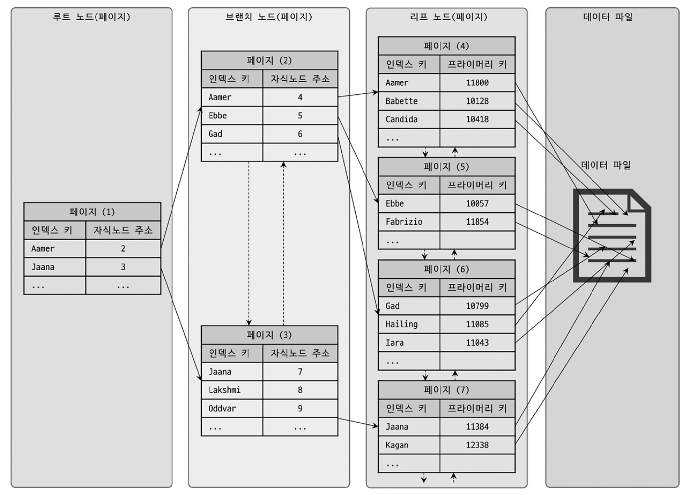
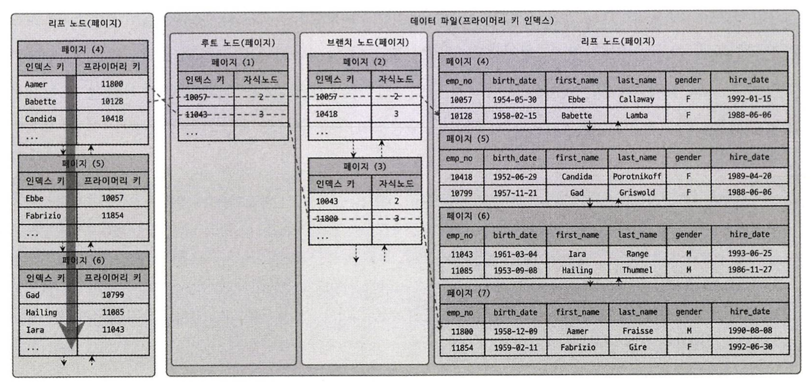
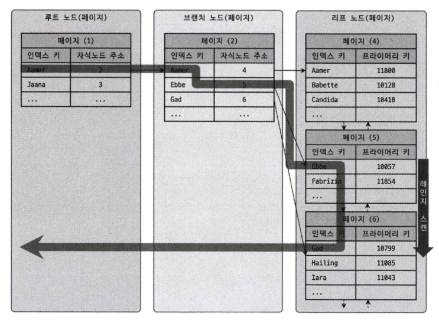
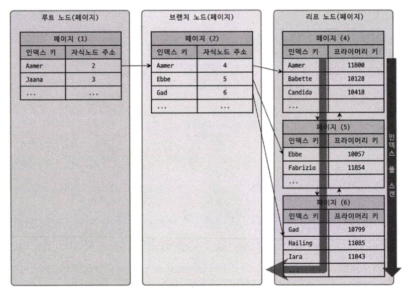
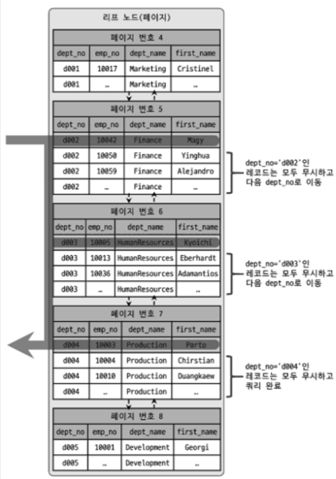
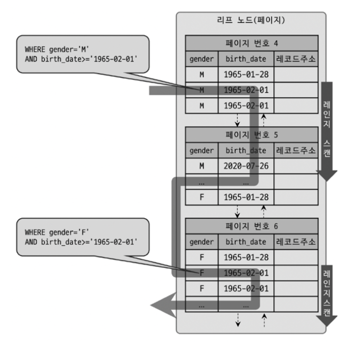

# 디스크 읽기 방식
- SSD는 디스크 원판을 기계적으로 회전시키지 않으므로 아주 빠른 데이터 입출력이 가능하다.
- SSD는 기존 하드 디스크 드라이브보다 랜덤 I/O가 훨씬 빠르다. 랜덤 I/O란 디스크 특정 위치로 헤드를 움직여야 하는 I/O 작업을 말한다. **디스크 원판을 가지지 않은 SSD에서도 랜덤 I/O와 순차 I/O의 성능 차이가 두드러진다**. 

# 인덱스
- **원하는 데이터를 빠르게 찾기 위해 해당 레코드가 저장된 주소를 키와 값의 쌍으로 인덱스를 만들어두는 것**이다. 컬럼의 값을 주어진 순서로 미리 정렬해서 보관한다.
- 데이터가 저장될 때마다 매번 정렬해야 하므로 저장하는 과정이 복잡하고 느리지만, 정렬되어 있기 때문에 원하는 값을 아주 빠르게 찾을 수 있다.
- 결론적으로 DBMS의 인덱스는 저장 성능을 희생하고, 그 대신 데이터의 읽기 속도를 높이는 기능이라고 볼 수 있다.

# B-TREE 인덱스

- 트리 구조 최상위에 하나의 **루트 노드(Root node)** 가 존재하고 그 하위에 자식 노드가 붙어 있는 형태를 말한다. 트리 구조 가장 하위에 있는 노드를 **리프 노드(Leaf node)** 라 하고, 트리 구조에서 루트와 리프 노드가 아닌 노드를 **브랜치 노드(Branch node)** 라고 한다. 
- 데이터베이스에서 인덱스와 실제 데이터가 저장된 데이터는 따로 관리되는데, 인덱스의 리프 노드는 항상 실제 데이터 레코드를 찾아가기 위한 주솟값을 가지고 있다. **인덱스는 테이블의 키 컬럼만 가지고 있으므로 나머지 컬럼을 읽으려면 데이터 파일에서 해당 레코드를 찾아야하기 때문**이다.

- 인덱스 키 값은 모두 정렬되어 있지만, 데이터 파일의 레코드는 정렬되어 있지 않은 상태이다. **InnoDB 테이블에서 레코드는 클러스터되어 디스크에 저장되므로 기본적으로 프라이머리 키 순서로 정렬되어 저장된다.**

## B-TREE 인덱스 키 추가 및 삭제

### 인덱스 키 추가
- 새로운 키 값이 B-TREE에 저장될 때 테이블 스토리지 엔진에 따라 새로운 키 값이 즉시 인덱스에 저장될 수도 있고, 그렇지 않을수도 있다.
- B-TREE에 저장할 때는 저장될 키 값을 이용해 B-TREE 상의 적절한 위치를 검색해야 한다. 
- 저장될 위치가 결정되면 레코드의 키 ㄷ과 대상 레코드의 주소 정보를 B-TREE 리프 노드에 저장한다.
- 리프 노드가 꽉 차서 더는 저장할 수 없을 때는 리프 노드가 분리돼야 하는데, 이는 상위 브랜치 노드까지 처리 범위가 넓어진다. **B-TREE는 상대적으로 쓰기 작업에 비용이 많이 들게 된다.**
- 대략적으로 시간을 계산하면, 테이블에 레코드를 추가하는 작업 비용을 1이라고 하면, 인덱스에 키를 추가하는 작업 비용을 1.5 정도로 예측한다. 중요한 것은 비용의 대부분이 메모리와 CPU에서 처리하는 시간이 아니라 **디스크로부터 인덱스 페이지를 읽고 쓰기**를 해야 해서 걸리는 시간이다.
- InnoDB에서는 인덱스 키 추가, 삭제 작업을 지연시켜 성능을 개선(체인지 버퍼)하는데, 프라이머리 키나 유니크 인덱스의 경우 중복 체크가 필요하기에 즉시 B-TREE에 추가하거나 삭제한다.

### 인덱스 키 삭제
- 키 값이 저장된 B-TREE 리프 노드를 찾아서 삭제 마크만 하면 된다. 삭제 마킹된 인덱스 공간은 계속 그대로 방치되거나 재활용할 수 있다.
- 마킹 작업 또한 디스크 쓰기가 필요하므로 I/O 작업이다. InnoDB에서는 이 작업 또한 지연처리 될 수 있다.

### 인덱스 키 변경
- 인덱스 키 값은 그 값에 따라 저장될 리프 노드의 위치가 결정되므로 B-TREE 키 값이 변경되는 경우에는 단순히 인덱스상의 키 값만 변경하는 것은 불가능하다.
- **B-TREE 키 값 변경 작업은 먼저 키 값을 삭제한 후, 다시 새로운 키를 추가하는 형태로 처리**한다.

### 인덱스 키 검색
- 인덱스 관리에 따르는 추가 비용을 감당하면서 인덱스를 구축하는 이유는 빠른 검색을 위해서다.
- **루트 노드부터 시작하여 브랜치 노드를 거쳐 최종 리프 노드까지 이동하면서 비교 작업을 수행하는데, 이를 트리 탐색**이라고 한다.
- 인덱스 트리 탐색은 SELECT, UPDATE, DELETE를 처리하기 위해 항상 레코드를 먼저 검색해야 할 경우에 사용된다.
- 100% 일치 또는 값의 앞부분만 일치하는 경우에 사용할 수 있으며, 부등호 비교 조건에서도 사용할 수 있지만 **인덱스를 구성하는 키 값의 뒷부분만 검색하는 용도로는 인덱스를 사용할 수 없다.**
- 인덱스 키 값에 변형이 가해진 후 비교되는 경우 절대 B-TREE의 빠른 검색 기능을 사용할 수 없다. 이미 변형된 값은 B-TREE 인덱스에 존재하는 값이 아니다. 따라서 **함수나 연산을 수행한 결과로 정렬한다거나 검색하는 작업은 B-TREE의 장점을 이용할 수 없다.**
  
## B-TREE 인덱스 사용에 영향을 주는 요소
- 인덱스를 구성하는 컬럼의 크기, 레코드 건수, 유니크한 인덱스 키 값의 개수 등에 따라 검색이나 변경 작업의 성능이 영향을 받는다.

### 인덱스 키 값의 크기
- InnoDB 스토리지 엔진은 디스크에 데이터를 저장하는 가장 기본 단위를 페이지 또는 블록이라고 한다. 디스크의 모든 **읽기 및 쓰기 작업의 최소 단위이며, 버퍼 풀에서 데이터를 버퍼링하는 기본 단위**이다.
- B-TREE는 자식 노드의 개수가 가변적인 구조로, 인덱스 페이지 크기와 키 값의 크기에 따라 자식 노드의 개수가 결정된다. 페이지 크기가 16KB이고, 인덱스 키가 16바이트, 자식 노드 주소가 12 바이트라면 16 * 1024 / (16 + 12) = 585개의 키가 한 페이지에 저장된다. **결국 인덱스 키 값의 크기가 커지면 디스크로부터 읽어야 하는 횟수가 늘어나고, 그만큼 느려지게 된다.**
- 인덱스 키 값의 길이가 길어진다는 것은 전체적인 인덱스 크기가 커진다는 것을 의미하고, InnoDB 버퍼 풀에 캐시해 둘 수 있는 레코드 수가 줄어든다.

### B-TREE 깊이
- B-TREE 인덱스 깊이는 상당히 중요하지만 직접 제어할 방법은 없다. 
- 인덱스 키 값의 평균 크기가 늘어나면 무슨 일이 일어날까?
  - 키가 16바이트인 경우 최대 2억(585 * 585 * 585개 정도의 키 값을 담을 수 있지만, 키 값이 32바이트로ㅈ늘어나면 5천만(372 * 372 * 372)개로 줄어든다. B-TREE 깊이는 몇 번이나 랜덤하게 디스크를 읽어야 하는지와 직결되는 문제다. **인덱스 키 값의 크기는 가능하면 작게 만드는 것이 좋다.**

### 선택도(기수성)
- 선택도(Selectivity) 또는 기수성(Cardinality)는 거의 같은 의미로 사용되며, 모든 인덱스 키 값 가운데 유니크한 값의 수를 의미한다. 전체 인덱스 키 값이 100개인데, 그중에서 10개라면 기수성은 10이다. 인덱스 키 값 가운데 중복된 값이 많아지면 많아질수록 기수성은 낮아지고 동시에 선택도 또한 떨어진다. **인덱스는 선택도가 높을수록 검색 대상이 줄어들기 때문에 그만큼 빠르게 처리한다.**

```sql
SELECT * 
FROM TB_TEST
WHERE country='KOREA' AND city='SEOUL';
```
- 데이터가 10_000개가 있고, country 컬럼의 유니크한 값이 10개인 경우와 1000개인 경우를 살펴보자. 위의 쿼리를 실행하면 A 케이스의 경우 평균 1_000건, B 케이스의 경우 평균 10건이 조회된다고 예측할 수 있다.
- **유니크한 값의 개수는 인덱스나 쿼리의 효율성에 큰 영향을 미친다.**

### 읽어야 하는 레코드의 건수
- 인덱스를 통해 테이블의 레코드를 읽는 것은 인덱스를 거치지 않고 바로 테이블의 레코드를 읽는 것보다 높은 비용이 드는 작업이다. 100만 건 중 50만 건을 읽어야 할 때 전체 테이블을 읽어서 필요 없는 50만 건을 버리는 것이 효율적인지, 인덱스를 통해 필요한 50만 건만 읽어오는 것이 효율적인지 판단해야 한다.
- **일반적으로 DBMS 옵티마이저에서는 인덱스를 통해 레코드 1건을 읽는 것이 테이블에서 직접 레코드 1건을 읽는 것보다 4~5배 정도 비용이 더 많이 드는 것으로 예측**한다. 전체 테이블 레코드의 20~25%를 넘어서면 인덱스를 이용하지 않고 풀 스캔이 더 효율적일 수 있다.

## B-TREE 인덱스를 통한 데이터 읽기

### 인덱스 레인지 스캔
- 인덱스를 통해 레코드를 한 건만 읽는 경우와 한 건 이상을 읽는 경우를 각각 다른 경우로 구분하지만, 여기선 모두 '인덱스 레인지 스캔'으로 표현한다.
```sql
SELECT *
FROM employees
WHERE first_name
BETWEEN 'Ebbe' AND 'Gad';
```

- 인덱스 레인지 스캔은 검색해야 할 인덱스 범위가 결졍됐을 때 사용하는 방식이다. 루트 노드에서부터 비교를 시작해 브랜치 노드를 거치고 최종적으로 리프 노드까지 찾아 들어가야만 필요한 레코드의 시작 지점을 찾을 수 있다.


- BTREE 인덱스에서 루트와 브랜치 노드를 이용해 스캔 시작 위치를 검색하고, 그 지점부터 필요한 방향으로 인덱스를 읽어 나가는 과정을 확인할 수 있다.
- 인덱스의 리프 노드에서 검색 조건에 일치하는 건들을 데이터 파일에서 레코드를 읽어오는 과정이 필요하다는 것이다. 이떄 리프 노드에 저장된 레코드 주소로 데이터 파일의 레코드를 읽어오는데, 레코드 한 건 한 건 단위로 랜덤 I/O가 발생한다.

> ### 인덱스 레인지 스캔 과정
1. 인덱스에서 조건을 만족하는 값이 저장된 위치를 찾는다.
2. 1번에서 탐ㅇ된 위치부터 필요한 만큼 인덱스를 차례대로 쭉 읽는다. 이 과정을 인덱스 스캔(index scan)이라고 한다.
3. 2번에서 읽어 들인 인덱스 키와 레코드 주소를 이용해 레코드가 저장된 페이지를 가져오고, 최종 페이지를 읽어온다.
- 쿼리가 필요로 하는 데이터에 따라 3번 과정은 필요하지 않을 수도 있고, 이를 `커버링 인덱스`라고 한다. 커버링 인덱스로 처리하는 쿼리는 디스크의 레코드를 읽지 않아도 되기에 디스크 랜덤 읽기가 상당히 줄어들고 성능은 그만큼 빨라진다.
  
### 인덱스 풀 스캔
- 인덱스의 처음부터 끝까지 모두 읽는 방식을 인덱스 풀 스캔이라고 한다. 일반적으로 인덱스의 크기는 테이블의 크기보다 작으므로 직접 테이블을 처음부터 끝까지 읽는 것보다는 인덱스만 읽는 것이 효율적이다. 쿼리가 인덱스에 명시된 컬럼만으로 처리할 수 있는 경우 주로 이 방식이 사용된다.

- **인덱스 리프 노드의 제일 앞 또는 제일 뒤로 이동한 뒤 인덱스의 리프 노드를 연결하는 링크드 리스트(리프 노드 사이를 연결하는 세로로 그려진 두 쌍의 그래프)를 따라서 처음부터 끝까지 스캔하는 방식을 인덱스 풀 스캔**이라고 한다. 이 방식은 인덱스 레인지 스캔보다는 빠르지 않지만 **테이블 풀 스캔보다는 효율적이다. 인덱스 전체 크기가 테이블 자체 크기보다 훨씬 작으므로 적은 디스크 I/O로 쿼리를 처리할 수 있기 때문**이다.

### 루스 인덱스 스캔
- 느슨하게 또는 듬성듬성 인덱스를 읽는 방식을 말한다.
- 중간에 필요하지 않은 인덱스 키 값은 무시하고 다음으로 넘어간다. 일반적으로 GROUP BY 또는 집합 함수 가운데 MAX() 또는 MIN() 함수에 대해 최적화 하는 경우에 사용된다.
```sql
SELECT dept_no, MIN(emp_no)
FROM dept_emp
WHERE dep_no BETWEEN 'd002' AND 'd004'
GROUP BY dept_no;
```
- dept_emp 테이블은 dept_no와 emp_no라는 두 개의 컬럼으로 인덱스가 생성되어 있다. dept_no 그룹을 첫 번쨰 레코드의 emp_no 값만 읽으면 되고, 옵티마이저는 WHERE 조건을 만족하는 범위 전체를 다 스캔할 필요가 없다는 것을 알기에 조건에 만족하지 않는 레코드는 무시하고 다음 레코드로 이동한다.


### 인덱스 스킵 스캔
```sql
ALTER TABLE employees
ADD INDEX ix_gender_birthdate (gender, birth_date);
```
- 이 인덱스를 사용하려면 WHERE 조건절에 gender 컬럼에 대한 비교 조건이 필수다.
- MySQL 8.0에서는 옵티마이저가 gender 컬럼을 건너뛰어서 birth_date 칼럼만으로도 인덱스 검색이 가능하게 해주는 인덱스 스킵 스캔(Index Skip Scan) 최적화 기능이 도입되었다. 이는 WHERE 조건절 검색을 위해 사용 가능하도록 용도가 훨씬 넓어진 것이다.


## 다중 컬럼 인덱스

## B-TREE 인덱스 정렬 및 스캔 방향

### 인덱스 정렬

### 인덱스 스캔 방향

### 내림차순 인덱스

## B-TREE 인덱스 가용성과 효율성

### 비교 조건의 종류와 효율성

### 인덱스의 가용성

### 가용성과 효율성 판단

# R-TREE 인덱스

## 구조 및 특성

## R-TREE 인덱스의 용도

# 전문 검색 인덱스

# 함수 기반 인덱스

# 멀티 밸류 인덱스

# 클러스터링 인덱스

# 유니크 인덱스

# 외래키