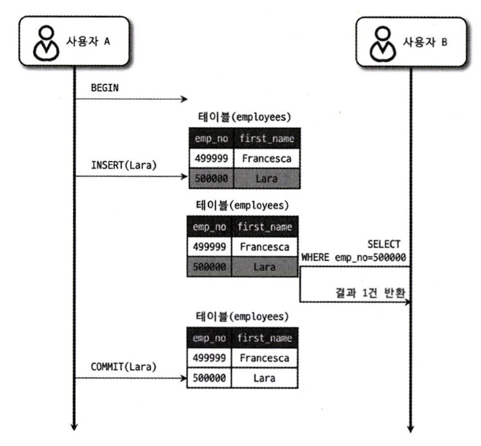
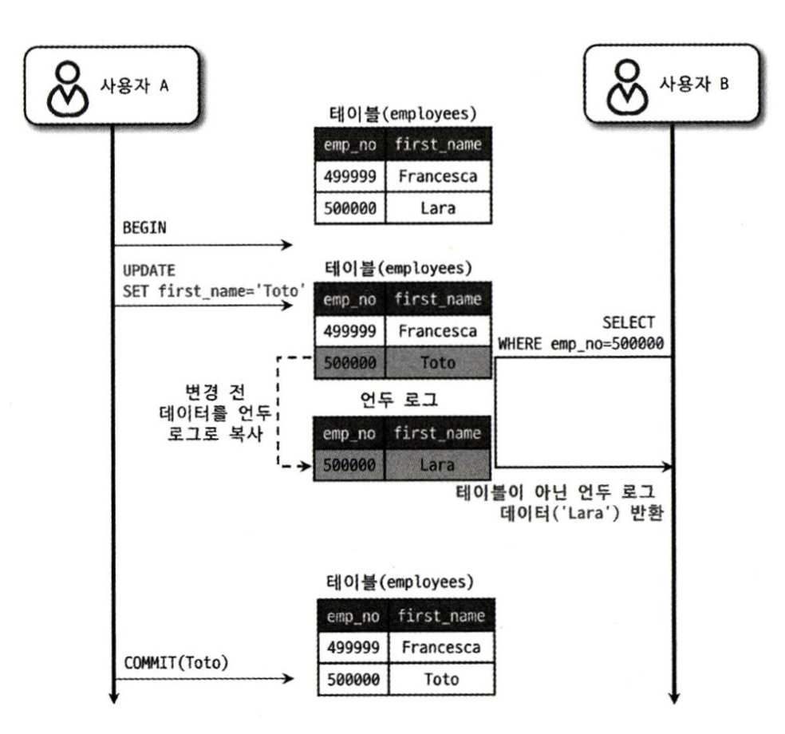
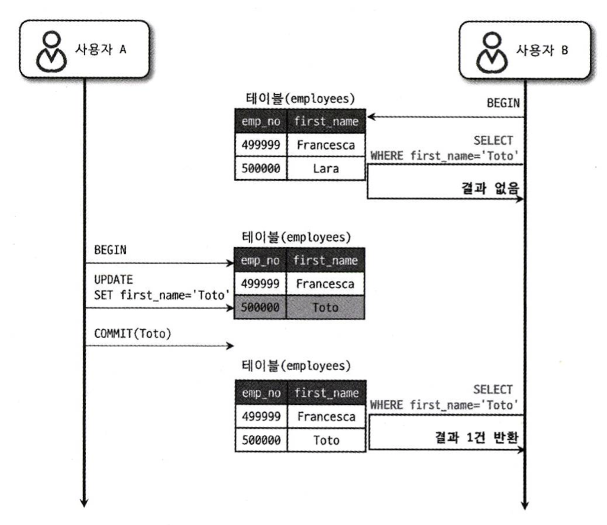
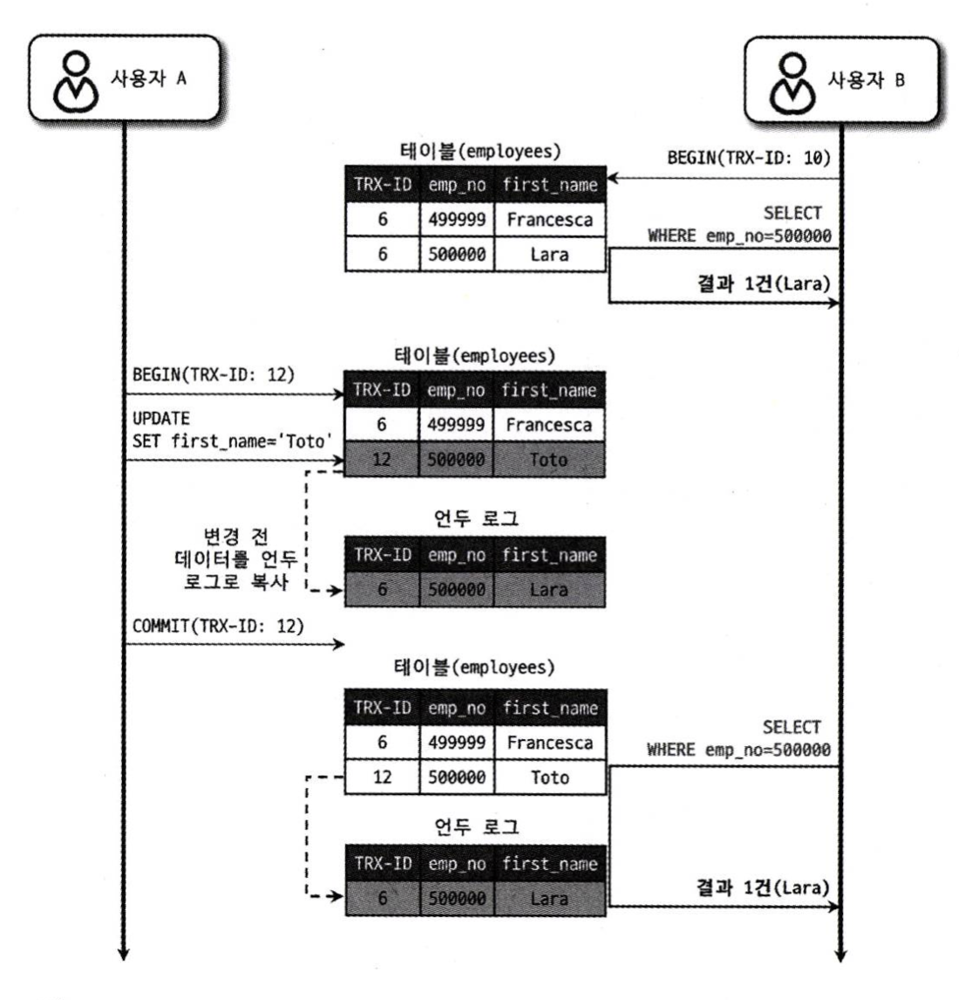
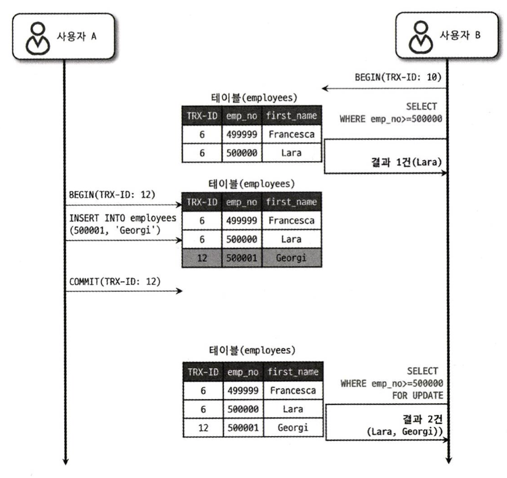

- [트랜잭션](#트랜잭션)
- [MySQL 엔진 잠금](#mysql-엔진-잠금)
  - [MySQL 엔진 잠금 종류](#mysql-엔진-잠금-종류)
    - [1. 글로벌 락](#1-글로벌-락)
    - [2. 테이블 락](#2-테이블-락)
    - [3. 네임드 락](#3-네임드-락)
    - [4. 메타데이터 락](#4-메타데이터-락)
- [InnoDB 스토리지 엔진 잠금](#innodb-스토리지-엔진-잠금)
  - [InnoDB 스토리지 엔진 잠금 종류](#innodb-스토리지-엔진-잠금-종류)
    - [1. 레코드 락](#1-레코드-락)
    - [2. 갭 락](#2-갭-락)
    - [3. 넥스트 키 락](#3-넥스트-키-락)
    - [4. 자동 증가 락](#4-자동-증가-락)
  - [인덱스와 잠금](#인덱스와-잠금)
  - [레코드 수준의 잠금 확인 및 해제](#레코드-수준의-잠금-확인-및-해제)
- [MySQL 격리 수준](#mysql-격리-수준)
  - [1. READ UNCOMMITTED](#1-read-uncommitted)
  - [2. READ COMMITTED](#2-read-committed)
  - [3. REPEATABLE READ](#3-repeatable-read)
  - [4. SERIALIZABLE](#4-serializable)

# 트랜잭션
- 트랜잭션이란 **작업의 완전성을 보장**해 주는 것이다. 하나의 논리적인 작업들을 모두 완전하게 처리하거나 처리하지 못할 경우 원 상태로 복구하여 일부만 적용되는 현상을 만들어주지 않게 한다. (데이터 정합성)

- 아래는 트랜잭션과 관련해서 헷갈릴 수 있는 개념이다.
 
> 잠금(Lock)은 **동시성을 제어하기 위한 기능**이고, 트랜잭션은 **데이터 정합성을 보장**하기 위한 기능이다. 
> 데이터 정합성(Consitency)이란 데이터가 **일관성** 있게 유지되는 것을 말하며, 데이터 무결성(Integrity)이란 데이터가 **정확한** 상태를 유지하는 것을 말한다.

- 프로그램 코드가 **데이터베이스 커넥션을 가지고 있는 범위**와 **트랜잭션이 활성화되어 있는 범위**를 **최소화**해야 한다.
  - 데이터베이스 커넥션의 개수는 유한하기에 소유하는 시간이 길어질수록 사용할 수 있는 커넥션의 양은 줄어든다.
  - 트랜잭션 중 외부 서비스를 이용한다면, 외부 서비스에 장애가 발생했을 때 DBMS 서버까지 장애가 날 가능성이 존재한다.

# MySQL 엔진 잠금
- **MySQL 엔진 레벨의 잠금은 모든 스토리지 엔진에 영향을 미치지만, 스토리지 엔진 레벨의 잠금은 스토리지 엔진 간 상호 영향을 미치지 않는다.**

## MySQL 엔진 잠금 종류

### 1. 글로벌 락
- `FLUSH TABLES WITH READ LOCK` 명령으로 획득할 수 있으며, MySQL에서 제공하는 잠금 가운데 가장 범위가 크다.
- 한 세션에서 글로벌 락을 획득하면 다른 세션에서 SELECT를 제외한 대부분의 DDL, DML을 실행할 때 글로벌 락이 해제될 때까지 해당 쿼리는 대기 상태가 된다.
- 글로벌 락이 **영향을 미치는 범위는 MySQL 서버 전체**이며, 작업 대상 테이블이나 데이터베이스가 다르더라도 동일한 영향을 미친다.

> FTWRL 명령이 실행되면 글로벌 락을 거는 동시에 MySQL에 존재하는 모든 테이블을 닫고 잠금을 건다. InnoDB에서는 트랜잭션을 지원하기 때문에 **이미 진행 중인 트랜잭션이나 쿼리는 정상적으로 완료**될 수 있지만, **새로운 트랜잭션이나 쓰기 작업은 대기 상태에 들어가며, 락이 해제될 때까지 추가적인 변경 작업은 수행할 수 없다.**

- 글로벌 락보다 조금 더 가벼운 백업 락은 테이블의 스키마나 사용자의 인증 관련 정보를 변경할 수 없다. 하지만, 일반적인 테이블의 데이터 변경은 허용된다. 백업 락의 도입 목적은 **정상적으로 복제는 실행되지만 백업의 실패를 막기 위해 DDL 명령이 실행되면 복제를 일시 중지**한다. 

### 2. 테이블 락
- 개별 테이블 단위로 설정되는 잠금이다. 명시적 또는 묵시적으로 특정 테이블 락을 획득할 수 있다. 명시적으로는 `LOCK TABLES table_name [ READ | WRITE]` 해당 명령어를 통해 락을 획득하고, `UNLOCK TABLES`로 락을 반납한다.
- 묵시적인 테이블 락은 쿼리가 실행되는 동안 자동으로 획득했다가 쿼리가 완료된 후 자동 해제된다. 하지만, **InnoDB 테이블의 경우 스토리지 엔진 차원에서 레코드 기반의 락을 제공하기에 단순 데이터 변경은 묵시적인 테이블 락이 설정되지 않는다. 더 정확히는 DDL의 경우에만 테이블 락이 설정된다고 봐야 한다.**

### 3. 네임드 락
- `GET_LOCK()` 함수를 이용해 임의의 문자열에 대해 잠금을 설정할 수 있다. 
- 잠금 대상이 테이블이나 레코드 또는 AUTO_INCREMENT와 같은 데이터베이스 객체가 아니고, 단순히 사용자가 지정한 문자열에 대해 획득하고 반납하는 잠금이다.
- **많은 레코드에 대해 복잡한 요건으로 레코드를 변경하는 트랜잭션에 유용하게 사용**할 수 있다. 배치 프로그램처럼 한꺼번에 많은 레코드를 변경하는 쿼리는 자주 데드락의 원인이 되곤 하는데, **동일 데이터를 변경하거나 참조하는 프로그램끼리 분류해서 네임드 락을 걸고 쿼리를 실행**하는 게 아주 간단히 해결하는 방법이다.

### 4. 메타데이터 락
- 데이버테이스 객체(테이블, 뷰 등)의 이름이나 구조를 변경하는 경우 획득하는 잠금이다. 명시적으로 획득할 수 없고, `RENAME TABLE tab_a TO tab_b` 같이 테이블의 이름을 변경하는 경우 자동으로 획득한다.

# InnoDB 스토리지 엔진 잠금
- MySQL 엔진 잠금과는 별개로 스토리지 엔진 내부에서 **레코드 기반 잠금 방식**을 탑재하고 있다.
- 잠금 정보가 상당히 작은 공간으로 관리되기에 레코드 락이 페이지 락 또는 테이블 락으로 레벨업되는 경우는 없다.

## InnoDB 스토리지 엔진 잠금 종류
### 1. 레코드 락
- 레코드 자체만을 잠그는 것을 레코드 락(Record lock, Record only lock)이라고 한다. 중요한 점은 **레코드 자체가 아니라 인덱스의 레코드를 잠근다는 것**이다. 인덱스가 하나도 없는 테이블이더라도 내부적으로 자동 생성된 클러스터 인덱스를 이용해 잠금을 설정한다.
- 보조 인덱스를 이용한 변경 작업은 넥스트 키 락 또는 갭 락을 사용하지만, 기본 키 또는 유니크 인덱스에 의한 변경 작업에서는 갭에 대해서는 잠그지 않고 레코드 자체에서만 락을 건다.
  - 기본 키나 유니크 인덱스는 레코드를 고유하게 식별할 수 있기 때문에, 변경 작업에서 갭을 잠글 필요 없이 **해당 레코드에만 락을 걸어 동시성을 높이고 성능을 향상**시킬 수 있다.

### 2. 갭 락
- 갭 락(Gap lock)은 레코드 자체가 아니라 레코드 바로 인접한 레코드 사이의 간격만을 잠그는 것을 의미한다.
- 이는 레코드와 레코드 사이의 간격에 새로운 레코드가 생성되는 것을 제어한다. 갭 락은 그 자체보다는 넥스트 키 락의 일부로 자주 사용된다.

### 3. 넥스트 키 락
- 레코드 락과 갭 락을 합쳐 놓은 형태의 잠금을 넥스트 키 락(Next key lock)이라고 한다. 

### 4. 자동 증가 락
- 자동 증가하는 숫자 값을 추출하기 위해 AUTO_INCREMENT라는 컬럼 속성 값을 제공한다. 한 번에 여러 레코드가 INSERT 되는 경우 각 레코드는 중복되지 않고 저장된 순서대로 증가하는 일련번호 값을 가져야 하기에 AUTO_INCREMENT 락이 필요하다.
- AUTO_INCREMENT 락을 명시적으로 획득하고 해제하는 방법은 없다. 아주 짧은 시간 동안 걸렸다가 해제되는 잠금이다.
  
## 인덱스와 잠금
- InnoDB 잠금은 레코드를 잠그는 것이 아니라 인덱스를 잠그는 방식으로 처리한다. 즉, **변경해야 할 레코드를 찾기 위해 검색한 인덱스의 레코드를 모두 락을 걸어야 한다.**
```sql
// employees 테이블에 first_name 컬럼만 멤버로 담긴 ix_firstname 인덱스 준비되어 있음
// employees 테이블에 first_name='Georgi'인 사원은 전체 253명, 'Georgi'이면서 last_name='Klassen'인 사원은 1명 존재

mysql > SELECT COUNT(*) FROM employees WHERE first_name='Georgi';
+----------+
| COUNT(*) |
+----------+
|      253 |
+----------+
 
mysql > SELECT COUNT(*) FROM employees WHERE first_name='Georgi' AND last_anme='Klassen';
+----------+
| COUNT(*) |
+----------+
|        1 |
+----------+

mysql > UPDATE employees SET hire_date=NOW() WHERE first_name='Georgi' AND last_name='Klassen';
```
- UPDATE 문장이 실행되면 1건의 레코드가 업데이트 될 것이다. 

> 그럼 몇 개의 레코드에 락을 걸어야 할까? 

- **조건은 first_name='Georgi'이며, last_name 컬럼은 인덱스에 없기에 first_name='Georgi'인 레코드 253건의 레코드가 모두 잠긴다.**

- UPDATE 쿼리를 위해 적절히 인덱스가 준비돼 있지 않다면 각 클라이언트 간의 동시성이 상당히 떨어지게 된다.

> 만약 테이블에 인덱스가 하나도 없다면?

- **테이블을 풀 스캔**하면서 UPDATE 작업을 하게 된다. 즉 전체 30여만 건의 모든 레코드를 잠그게 된다. 이처럼 인덱스 설계가 정말 중요하다.

## 레코드 수준의 잠금 확인 및 해제
- 레코드 수준의 잠금은 테이블 레코드 각각에 잠금이 걸리므로 그 레코드가 자주 사용되지 않는다면, 오랜 시간 잠겨 있어도 잘 발견되지 않는다.
- 잠금과 잠금 대기 순서 확인하기
```sql
SHOW PROCESSLIST;

select 
    r.trx_id waiting_trx_id,
    r.trx_mysql_thread_id waiting_thread,
    r.trx_query waiting_query,
    b.trx_id blocking_trx_id,
    b.trx_mysql_thread_id blocking_thread,
    b.trx_query blocking_query
FROM
    performance_schema.data_lock_waits w
INNER JOIN 
    information_schema.innodb_trx b
ON
    b.trx_id = w.blocking_engin_transaction_id
INNER JOIN
    information_schema.innodb_trx r
ON
    r.trx_id = w.requesting_engine_transaction_id;
```
- 여기서 특정 스레드가 어떤 잠금을 가지고 있는지 더 상세히 확인하고 싶다면,
```sql
SELECT * FROM performance_schema.data_locks \G;
```
- 특정 스레드가 잠금을 가진 상태에서 오랜 시간 멈춰있다면,
```sql
KILL 17;
```

# MySQL 격리 수준
- 격리 수준이란 **동시에 실행되는 트랜잭션들이 서로에게 미치는 영향을 제어하는 것**을 말한다.

> ## 세 가지 부정합 문제
- DIRTY READ: 트랜잭션이 아직 커밋되지 않은 다른 트랜잭션의 변경사항을 읽는 경우
- NON-REPEATABLE READ: 같은 트랜잭션 내에서 동일한 쿼리를 여러 번 실행했을 때, 그 결과가 다른 경우
- PHANTOM READ: 트랜잭션이 동일한 범위 쿼리를 두 번 이상 실행할 때, 다른 트랜잭션이 데이터를 삽입하거나 삭제함으로써 결과 집합이 달라지는 현상

## 1. READ UNCOMMITTED
- **각 트랜잭션 변경 내용이 COMMIT이나 ROLLBACK 여부에 상관없이 다른 트랜잭션에서 보인**다.


> 사용자 B가 사용자 A가 변경 사항을 **커밋하기도 전에 해당 사원을 검색**하고 있고, **커밋되지 않은 변경된 내용을 확인**할 수 있다.

- **DIRTY READ 발생, NON-REPEATABLE READ 발생**한다. 정합성에 많은 문제가 발생한다.

## 2. READ COMMITTED
- **어떤 트랜잭션에서 데이터를 변경했더라도 COMMIT이 완료된 데이터만 다른 트랜잭션에서 확인**할 수 있다. 
 

> "Lara"에서 "Toto"로 이름을 변경했고, **새로운 값인 "Toto"는 employees 테이블에 즉시 기록되고, 이전 값인 "Lara"는 언두 영역에 백업**된다. 사용자 A가 커밋을 수행하기 전에 B가 해당 데이터를 검색하게 되면, **"Lara"로 조회**된다. (**언두 영역**에서 가져온 것)

- **DIRTY READ 없고, NON-REPEATABLE READ 발생**한다. 오라클 DBMS에서 기본적으로 사용하는 격리 수준이며, 온라인 서비스에서 가장 많이 사용되는 격리 수준이다.



> 사용자 B가 트랜잭션 처음에 "Toto"인 사용자를 검색했지만, 결과가 없었다. 사용자 A가 사원의 이름을 변경하고 커밋을 실행한 후에 사용자 B가 동일한 트랜잭션에서 다시 "Toto"인 사용자를 검색하면 처음과 다르게 "Toto"인 사용자가 검색된다. 즉,  NON-REPEATABLE READ가 발생하는 것이다.

## 3. REPEATABLE READ
- MVCC를 이용해 언두 영역에 백업된 이전 데이터를 이용해 동일 트랜잭션 트랜잭션 내에서는 동일한 결과를 보여주는 것을 보장한다.



> 사용자 A가 사원의 이름을 변경하고 커밋하였다. 사용자 B는 A가 커밋하기 전과 후에 해당 사원을 검색한 상황이다. **커밋하기 전에는 기존 이름인 "Lara"가 검색되고, A가 변경된 것을 커밋한 후에도 언두 영역에서 저장된 "Lara"를 읽어와 반복 가능한 읽기를 제공**한다.

- 언두 로그는 관련된 트랜잭션이 계속 되는 동안 지속적으로 생성되기 때문에 트랜잭션이 길어지면 다음과 같은 문제점을 갖는다.
  - 언두 로그가 많아지게 되면서 기록들 사이에서 값을 탐색하는 시간이 길어진다.
  - 언두 로그 값을 저장하는 공간이 지나치게 커질 수 있다.

- DIRTY READ 없고, NON-REPEATABLE READ 없다. **MySQL InnoDB에서 기본으로 사용하는 격리수준**이다.



> 일반적인 DB에서 **다른 트랜잭션에서 새로운 레코드를 삽입하거나 삭제하는 작업으로 인해 동일한 트랜잭션 내에서 다시 조회할 때 결과가 다르게 나타나는 팬텀 리드가 발생**할 수 있다. **SELECT ... FOR UPDATE**를 사용하더라도 **조회된 레코드에 쓰기 잠금을 거는 것이고, 잠금이 걸리지 않은 레코드가 추가되거나 삭제되는 것을 막을 수 없기 때문**이다.

> **InnoDB**에서는 SELECT ... FOR UPDATE를 사용할 때 **넥스트 키 락**을 적용하여 **조회된 레코드뿐만 아니라 관련 범위까지 잠금을 설정하기에 팬텀 리드를 예방**할 수 있다.

## 4. SERIALIZABLE
- **읽기 작업도 공유 잠금을 획득해야 하며, 동시에 다른 트랜잭션은 그러한 레코드를 변경할 수 없는 가장 엄격한 격리수준**이다. 
- DIRTY READ 없고, NON-REPEATABLE READ 없고, PHANTOM READ 없다. 
