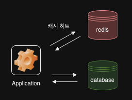
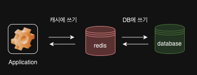
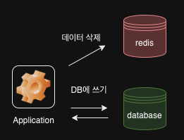
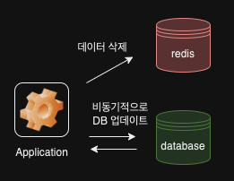

# 레디스 캐시로 사용하기
- **캐시란 데이터의 원본보다 더 빠르고 효율적으로 접근할 수 있는 임시 데이터 저장소를 의미**한다.
- 다음 조건에서 캐시를 도입했을 때 성능을 효과적으로 개선할 수 있다.
  1. **원본 데이터 저장소에서 원하는 데이터를 찾기 위해 검색하는 시간이 오래 걸리거나, 매번 계산을 통해 데이터를 가져와야 한다.**
  2. **캐시에서 데이터를 가져오는 것이 원본 데이터 저장소 데이터를 요청하는 것보다 빨라야 한다.**
  3. **캐시에 저장된 데이터는 잘 변하지 않는 데이터이다.**
  4. **캐시에 저장된 데이터는 자주 검색되는 데이터이다.**
- 레디스는 모든 데이터를 메모리에 저장하는 인메모리 데이터 저장소이기 때문에 관계형 데이터베이스보다 더 빠르다.
- 레디스의 클러스터를 사용하면 스케일 아웃을 쉽게 처리할 수 있다. (수평 확장 간단)

## 캐싱 전략
### 1. 읽기 전략 - look aside

- 동작 과정
  1. 찾고자 하는 데이터가 먼저 캐시에 있는지를 확인한 뒤, 캐시에 데이터가 있으면 캐시에서 데이터를 읽어온다. (**캐시 히트**)
  2. 찾고자 하는 데이터가 없을 때에는 **캐시 미스**가 발생한다. 직접 데이터베이스에 접근해 찾고자 하는 데이터를 가져오고, 이를 다시 캐시에 저장한다.
- 레디스에 문제가 생겨 접근을 할 수 없는 상황이 발생해도 서비스 장애로 이어지지 않는다. 하지만, DB에는 연결된 커넥션 만큼 부하가 발생한다.
- 미리 데이터베이스에 데이터를 밀어넣어주는 작업을 **캐시 워밍**이라고 한다. 

### 2. 쓰기 전략    

> 캐시는 데이터베이스에 저장돼 있는 데이터를 단순히 복사해 온 값이다. 따라서 **원본 데이터와 동일한 값을 갖도록 유지하는 것이 필수적**이다.

#### 1) write through

- **데이터베이스에 업데이트할 대마다 매번 케시에도 데이터를 업데이트**한다.
- 캐시는 항상 최신 데이터를 가지고 있다는 장점이 있지만, 매번 2개의 저장소에 저장되기 때문에 오버헤드가 있다.
- 다시 사용하지 않는 데이터도 무조건 캐시에 저장되기 때문에 만료 시간 설정이 권장된다.

#### 2) cache invalidation

- **데이터베이스에 값을 업데이트할 때마다 캐시에서는 데이터를 삭제**한다.
- 저장소에서 특정 데이터를 삭제하는 것이 새로운 데이터를 저장하는 것보다 훨씬 리소스를 적게 사용하기 때문에 앞선 write through 단점을 보완한 방법이라고 볼 수 있다. 

#### 3) write behind(write back)

- 쓰기가 빈번하게 발생한다면, write behind 방식을 고려할 수 있다. **데이터를 먼저 빠르게 접근할 수 있는 캐시에 업데이트한 뒤 이후에 비동기적으로 데이터베이스에 업데이트하는 방식**이다.
- 캐시에 문제가 생겨 데이터가 손실될 수 있는 위험이 존재한다.

### 3. 만료시간 지정하기
- **레디스에서 만료 시간, TTL(Time To Live)은 데이터가 얼마나 오래 저장될 것인지를 나타내는 시간 설정**이다.
- 만료 시간은 일반적으로 초 단위로 표현되며, 지정된 시간이 지난 후 레디스에서 자동으로 삭제한다.
```
127.0.0.1:6379> set a 100
OK
127.0.0.1:6379> expire a 50
(integer) 1
127.0.0.1:6379> TTL a
(integer) 46
127.0.0.1:6379> INCR a
(integer) 101
127.0.0.1:6379> TTL a
(integer) 23
127.0.0.1:6379> RENAME a app
OK
127.0.0.1:6379> TTL app
(integer) -2
```
- `expire` 커맨드는 **키에 대한 만료 시간을 확인**한다.** 키가 존재하지 않을 때는 -2, 키에 대해 만료 시간이 지정되지 않았을 경우 -1을 반환**한다.
- TTL과 EXPIRE 커맨드는 초 단위로, PTTL과 PEXPIRE 커맨드는 밀리 세컨드 단위로 동작한다.
- 기존 키에 새로운 값을 덮어쓸 때 이전에 설정한 만료 시간은 유지되지 않고 사라진다.

#### 레디스 키 삭제 방식
- 키는 Passive 방식과 Active 방식 두 가지로 삭제된다.
- 전자는 **클라이언트가 키에 접근하고자 할 때 키가 만료됐다면 메모리에서 수동적으로 삭제**한다. 사용자가 접근하지 않은 키는 삭제되지 않는다.
- 후자는 **TTL 값이 있는 키 중 20개를 랜덤하게 뽑아낸 뒤, 만료된 키를 모두 메모리에서 삭제한다. 만약 25% 이상의 키가 삭제됐다면 다시 20개의 키를 뽑아 확인하고, 아니라면 뽑아놓은 20개의 키 집합에서 다시 확인한다. 이러한 과정을 1초에 10번씩 수행**한다.
- **만료된 키를 곧바로 삭제하지 않기 때문에 키를 삭제하는 데 들어가는 리소스를 줄일 수 있지만, 그만큼 메모리를 더 사용할 가능성이 존재**한다. 최악의 경우 25% 이미 만료된 키 값일 수 있다.


### 4. 메모리 관리와 maxmemory-policy
- 데이터의 **최대 저장 용량을 설정하는 maxmemory 설정**과 이 용량을 초과하면 처리 방식을 결정하는 **maxmemory-policy 설정**값을 사용해 메모리를 관리한다.

#### 1) Noeviction
- 기본값이다. 레디스에 데이터가 가득 차더라도 **임의로 데이터를 삭제하지 않고 더 이상 레디스에 데이터를 저장할 수 없다는 에러를 반환**한다.
- 하지만 캐시에 데이터를 저장하지 못해 에러가 발생할 경우 로직에 따라 장애 상황으로 이어질 수 있다. 이런 상황에서는 **관리자가 직접 레디스의 데이터를 직접 관리**해야 한다.
- 데이터가 가득 차더라도 캐시 내부적 판단으로 데이터를 삭제하는 것이 위험하다고 판단될 때 이 옵션을 사용할 수 있다.

#### 2) LRU eviction (Least Recently Used)
- **데이터가 가득 찼을 때 가장 오래된 데이터부터 삭제하**는 정책이다.
- 두 가지 설정값을 가지고 있다.
  - 1. volatile-lru: 만료 시간이 설정돼 있는 키에 한해서 LRU 방식으로 삭제한다. 임의적인 방식으로 삭제되면 안되는 값에 대해서는 만료 시간을 지정하지 않는다면 volatile-lru 방식을 사용하는 것이 적합할 수 있다. 만약 레디스 내부에 저장된 키에 모두 만료 시간이 지정돼 있지 않다면 이는 noeviction 상황과 동일하다. (삭제할 수 있는 키가 없어 데이터를 저장할 수 없다는 에러)
  - 2. allkeys-LRU: 공식 문서에서 권장하는 방법이다. 모든 키를 LRU 방식으로 삭제한다.

#### 3) LFU eviction
- **가장 자주 사용되지 않는 데이터부터 삭제**하는 정책이다. 키가 오랫동안 사용되지 않았더라도 과거에 자주 액세스했던 키라면 우선순위가 높아지게 된다.
  - 1. volatile-lfu: 만료 시간이 설정돼 있는 키에 한해서 LFU 방식으로 키를 삭제한다.
  - 2. allkeys-lfu: 모든 키에 대해 LFU 알고리즘을 이용해 데이터를 삭제한다.

#### 4) RANDOM eviction
- **저장된 키 중 하나를 임의로 골라내 삭제**한다. 삭제될 키 값을 계산하지 않아도 된다는 점에서 레디스의 부하를 줄여준다.
- 하지만, 나중에 사용될 수도 있는 데이터를 삭제할 가능성이 높아지기에 다시 캐시에 넣어주는 불필요함을 유발할 수 있다. LRU, LFU도 근사 알고리즘을 사용하기 때문에 성능을 위해서 해당 옵션을 적용하는 건 권장되지 않는 방법이다.

#### 5) volatile-ttl
- **만료 시간이 가장 작은 키를 삭제**한다. 삭제 예정 시간이 얼마 남지 않은 키를 삭제한다. LRU, LFU 알고리즘처럼 근사 알고리즘을 사용하여 모든 키를 스캔하지 않는다.

### 5. 캐시 스탬피드 현상(Cache Stampede)
- 레디스를 캐시로 활용할 때 모든 키에 대해 만료 시간을 설정하는 것을 권장하지만, 대규모 트래픽 환경에서 만료 시간을 어떻게 설정하느냐에 따라 캐시 스탬피드와 같은 현상이 발생할 수 있다.
- **여러 개의 애플리케이션에서 바라보던 키가 레디스에서 만료돼 삭제된다면 서버들은 한꺼번에 데이터베이스에 가서 데이터를 읽어오는 과정을 거친다. 이를 중복 읽기(duplicate read)라 한다. 이후 각 애플리케이션은 읽어온 데이터를 레디스에 쓰는데, 이 또한 여러번 반복되므로 중복 쓰기(duplicate write)가 발생**한다.
- 정렬이나 카운팅처럼 데이터베이스 쿼리에서 실행하는 데 오랜 시간이 걸리는 작업을 미리 계산해서 캐시해두기 때문에 여러 애플리케이션이 무거운 작업을 동시에 실행해 부하가 가중된다. 이 현상을 **계단식 실패(cascading failure)**라고도 한다.

#### 1. 적절한 만료 시간 설정
- 캐시 스탬피드 현상을 줄이기 위한 가장 간단한 방법은 **만료 시간을 너무 짧지 않게 설정**하는 것이다.

#### 2. 선 계산
- **캐시 스템피드가 문제되는 이유는 데이터가 만료되는 시점에 여러 애플리케이션에서 이를 동시다발적으로 인지하고, 이후 작업을 동시에 진행하기 때문**이다.
- 만약 키가 실제로 만료되기 전에 이 값을 미리 갱신해준다면 동시에 데이터베이스에 접근하는 애플리케이션 수를 줄여 부하를 줄일 수 있다.
- **레디스가 만료되기 전 랜덤한 확률로 데이터베이스에서 접근해 데이터를 읽어와 캐시의 값을 갱신**한다.

#### 3. PER 알고리즘 (Probabilistic Eary Recomputation)
- **캐시 값이 만료되기 전에 언제 데이터베이스에 접근해서 값을 읽어오면 되는지 최적으로 계산**할 수 있다.
```redis
currentTime - ( timeToComplete * beta * log(rand())) ) > expiry

- currentTime: 현재 남은 만료 시간
- timeToCompute: 캐시된 값을 다시 계산하는 데 걸리는 시간
- beta: 기본적으로 1.0보다 큰 값으로 설정 가능
- rand(): 0과 1 사이의 랜덤 값을 반환하는 함수
- expiry: 키를 재설정할 때 새로 넣어줄 만료 시간
```
- timeToCompute * beta * log(rand())는 무작위성을 가진 값이며, 이 값은 항목 만료 여부에 영향을 준다. 만약 currentTime에서 TimeToCompute * beta * log(rand())를 빼서 얻은 값이 expire보다 크다면 조건은 거짓이 된다. **만료 시간이 가까워질수록 currentTime과 expire 차이가 작아지며, rank() 함수가 반환한 무작위 값에 의존하기에 조건이 참이 될 확률이 높아진다. 이것은 만료 시간이 점점 다가올 때 더 자주 만료된 캐시 항목을 확인하게 되는 것을 의미**한다.
- 데이터를 가져오는 과정에서 GET 대신 이 함수를 사용하는 것은 성능을 향상 시킬 수 있다.

# 레디스 세션으로 사용하기
- 세션이란 서비스를 사용하는 클라이언트의 상태 정보를 의미한다.
- 웹 서버별로 세션 스토어를 따로 관리한다면 유저는 유저의 세션 정보를 갖고 잇는 웹 서버에 종속된다. 
## 1. ALL-TO-ALL
- 유저의 세션 정보를 모든 웹 서버에 복제해서 저장하는 방법이다.
- 유저의 세션 데이터는 여러 웹 서버에 분산되지만, 다른 웹 서버에 저장된 유저의 세션 정보는 무의미하다. 또한 데이터를 복제하는 과정에서 불필요한 네트워크 트래픽이 발생한다.
  
## 2. 데이터베이스 세션 스토어
- 서비스가 커져 유저가 많아질수록 데이터베이스를 세션 스토어로 사용하는 것은 서비스의 전반적인 응답 속도를 저하시킬 수 있다.

## 3. 레디스 세션 스토어
- 여러 서버에서 세션 스토어를 바라보도록 구성하는 방식이다. 앞선 문제를 다 해결할 수 있다.

# 캐시와 세션의 차이
- **캐시는 데이터의 완벽한 서브셋으로 동작**한다. 캐시가 갖고 있는 데이터는 모두 데이터베이스에 있으며, 캐시 내부의 데이터가 유실되더라도 해당 데이터는 데이터베이스에서 찾을 수 있다.
- 캐시에 저장된 데이터는 여러 애플리케이션에서 함께 사용할 수 있고, 함께 사용할수록 더 효율적이다. 하지만, **세션 스토어에 저장된 데이터는 여러 사용자간 공유되지 않으며, 특정 사용자 ID에 한하여 유효**하다.
- **세션 스토어로 활용할 때 데이터 흐름을 보면, 세션 스토어가 가지고 있는 데이터는 유일**할 수 있다. (세션이 시작될 때 데이터를 로드하고, 세션이 끝날 때 세션 데이터를 저장하기 때문)
