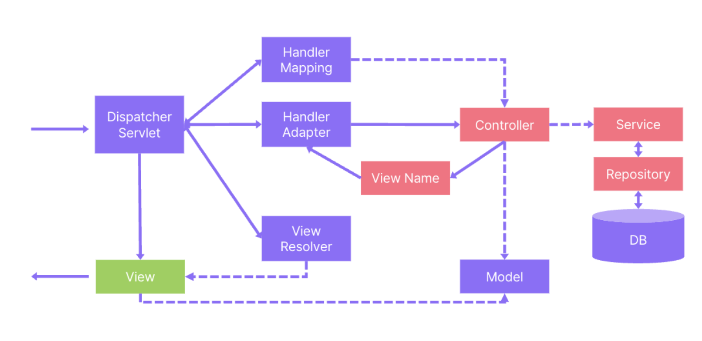

<!-- @import "[TOC]" {cmd="toc" depthFrom=1 depthTo=6 orderedList=false} -->

<!-- code_chunk_output -->

- [Spring, Spring Boot](#spring-spring-boot)
- [Spring MVC](#spring-mvc)
- [MVC1, MVC2](#mvc1-mvc2)
- [dispatcher servlet](#dispatcher-servlet)
- [IoC(Inversion of Control)](#iocinversion-of-control)
- [DI(Dependency Injection)](#didependency-injection)
- [Spring Bean, Component](#spring-bean-component)
  - [Spring Bean](#spring-bean)
  - [Component](#component)
- [Spring Container](#spring-container)
- [VO, DTO, DAO](#vo-dto-dao)
  - [VO (Value Object)](#vo-value-object)
  - [DTO(Data Transfer Object)](#dtodata-transfer-object)
  - [DAO(Data Access Object)](#daodata-access-object)
- [질문 모음](#질문-모음)
  - [1. 스프링과 스프링 부트의 차이점에 대해서 설명해 주세요](#1-스프링과-스프링-부트의-차이점에-대해서-설명해-주세요)
  - [2. MVC가 무엇인지 설명해 주세요.](#2-mvc가-무엇인지-설명해-주세요)
  - [3. 디스패처 서블릿이 무엇인지 설명해 주세요.](#3-디스패처-서블릿이-무엇인지-설명해-주세요)
  - [4. 디스패처 서블릿의 동작과정에 대해 설명해 주세요.](#4-디스패처-서블릿의-동작과정에-대해-설명해-주세요)
  - [5. DispatcherServlet 구현을 보면 HandlerMapping, HandlerAdapter 컬렉션이 있다. 역할과 이유는?](#5-dispatcherservlet-구현을-보면-handlermapping-handleradapter-컬렉션이-있다-역할과-이유는)
  - [그럼 어떤 컬렉션을 사용했을까? 이유는?](#그럼-어떤-컬렉션을-사용했을까-이유는)
  - [6. IoC에 대해 설명해주세요. 장점은?](#6-ioc에-대해-설명해주세요-장점은)
  - [7. DI에 대해 설명해주세요. 장점과 주입 방법은?](#7-di에-대해-설명해주세요-장점과-주입-방법은)
  - [8. Spring Bean과 Component에 대해 설명해 주세요.](#8-spring-bean과-component에-대해-설명해-주세요)
  - [9. BeanFactory와 ApplicationContext 차이](#9-beanfactory와-applicationcontext-차이)
  - [10. Spring Container, IoC Container에 대해 설명해 주세요.](#10-spring-container-ioc-container에-대해-설명해-주세요)
  - [11. VO와 DTO, DAO에 대해 설명해 주세요.](#11-vo와-dto-dao에-대해-설명해-주세요)
  - [12. 언제 수동 빈을 등록하는가?](#12-언제-수동-빈을-등록하는가)
  - [13.  스프링 컨테이너에 빈 생성 과정](#13--스프링-컨테이너에-빈-생성-과정)
  - [14. 빈이 충돌했던 경험이 있는지? 어떻게 해결하였는지? @Qualifier, @Primary 에 대한 설명](#14-빈이-충돌했던-경험이-있는지-어떻게-해결하였는지-qualifier-primary-에-대한-설명)
  - [15. 스프링 빈 생명주기에 대해 설명해 주세요.](#15-스프링-빈-생명주기에-대해-설명해-주세요)
  - [16. 빈 생명 주기에서 콜백 메서드 사용하는 방법](#16-빈-생명-주기에서-콜백-메서드-사용하는-방법)
  - [17. 빈 Scope에 대해 설명해주세요. 싱글톤과 프로토타입의 차이는 무엇인가요?](#17-빈-scope에-대해-설명해주세요-싱글톤과-프로토타입의-차이는-무엇인가요)
  - [18. 스프링 컨테이너는 싱글톤과 프로토타입 빈을 어떻게 관리하는가?](#18-스프링-컨테이너는-싱글톤과-프로토타입-빈을-어떻게-관리하는가)

<!-- /code_chunk_output -->


# Spring, Spring Boot

- 스프링(Spring)은 스프링 핵심 모듈(코어, AOP, Data …)을 모아서 만든 프레임워크.  개발자가 직접 설정 파일을 작성. 필요한 개발환경 직접 셋팅. 세밀하고 복잡한 기능을 사용하고 싶을 때 사용.
- 스프링 부트(SpringBoot)는 Spring 기반 애플리케이션을 쉽게 만들 수 있는 도구. 기본적인 설정 자동 구성. 내장 톰캣 지원. 의존성 패키지 제공

# Spring MVC

- Spring Framework의 일부, 모델-뷰-컨트롤러 디자인 패턴을 구현한 웹 프레임워크
- 사용자 인터페이스와 비즈니스 로직을 분리하여 유연하고 확장할 수 있는 코드 생산을 가능
- RESTful 웹 서비스 구축 지원
- 구성 요소
    - **모델(Model)**
        - 애플리케이션의 데이터와 비즈니스 로직을 담당
    - **뷰(View)**
        - 사용자에게 데이터를 표시하는 역할
    - **컨트롤러(Controller)**
        - 사용자 요청을 처리하고, 적절한 모델과 뷰를 선택하는 역할

# MVC1, MVC2

- MVC1 패턴
    - MVC1에서는 JSP가 모델, 뷰, 컨트롤러 역할을 함께 처리
        - 개발의 단순함: 모든 로직을 하나의 JSP 파일 내에서 처리하기 때문에 개발이 단순
        - 유지보수의 어려움: 뷰에 모델, 컨트롤러 로직이 혼합되어 있어 유지보수가 어려움
- MVC2 패턴
    - MVC2에서는 모델(서비스 및 DAO), 뷰(JSP), 컨트롤러(Servlet)가 명확하게 분리되어 처리
        - 유지보수의 용이함 : 로직이 분리되어 있어 각 컴포넌트의 수정 및 유지보수가 용이
        - 확장성과 유연성 : 각 부분의 독립적인 개발이 가능해 확장성과 유연성이 높음

# dispatcher servlet

- HTTP 프로토콜로 들어오는 모든 요청을 가장 먼저 받아 적합한 컨트롤러에 위임해주는 Front Controller.
- 클라이언트로 부터 어떠한 요청이 오면 Tomcat과 같은 서블릿 컨테이너가 요청을 받음
- 그리고 이 모든 요청을 프론트 컨트롤러인 디스패처 서블릿이 가장 먼저 처리
- 디스패처 서블릿은 공통적인 작업을 먼저 처리한 후에 해당 요청을 처리해야 하는 컨트롤러를 찾아 작업을 위임



1. 클라이언트의 요청을 DispatcherServlet에서 수신
2. HanddlerMapping에서 요청을 처리할 핸들러 찾음
3. 해당 핸들러를 실행할 수 있는 Handler Adapter를 찾고, handle 메서드를 통해 컨트롤러 실행한다
4. 실행 결과를 Model에 설정하고 ViewName을 반환한다
5. ViewName으로 View를 찾는 작업을 ViewResolver에게 요청한다
6. 반환된 View에 대한 렌더링 프로세스를 View에 요청한다.

# IoC(Inversion of Control)

- 객체의 생성과 의존성 관리를 프로그램 코드가 아닌 외부 시스템에 위임
- 장점
    - 유연성: 객체 생성과 의존성 관리를 외부 컨테이너가 담당하므로, 애플리케이션 코드를 수정하지 않고도 객체 간의 관계를 변경할 수 있음
    - 의존성 관리: 객체는 필요한 의존성을 직접 생성하거나 찾지 않음. 제어의 권한이 프레임워크나 컨테이너로 넘어감
    - 결합도 감소: 객체는 서로 느슨하게 연결, 변경 또는 확장에 유리

# DI(Dependency Injection)

- 객체가 직접적으로 의존성을 생성하지 않고, 외부로 부터 주입받음
- 장점
    - 유연성: 객체간의 결합도 낮춤, 다양한 구현체 쉽게 교체 가능
    - 테스트 용이: 의존성을 외부에서 주입받기 때문에 mock 객체 등을 사용해 단위 테스트 작성 용이
- Spring에서는 의존 관계 주입을 외부 설정 파일이나 어노테이션을 이용
- 주입 방식
    - 생성자 주입: 객체 불변 상태 유지, 객체 생성 시 완전한 상태로 초기화 → 순환 의존성
    - 세터 주입: 유연하게 의존성 주입 가능, final X(객체 불변성 X)의존성 주입이 완전하지 않은 상태에서 객체가 사용될 가능성
    - 필드 주입: 간결함, final X(객체 불변성 X), 의존성 주입을 위해 리플렉션 사용

# Spring Bean, Component

## Spring Bean

- 스프링 IoC 컨테이너에 의해 생성되고 관리되는 객체 (new를 이용해서 생성한 객체가 아니라 스프링에 의해 생성되고 관리되는 객체를 말함. ApplicationContext.getBean()으로 얻을 수 있는 객체)
- IoC 컨테이너는 스프링 애플리케이션 컨텍스트(ApplicationContext)에서 빈을 생성, 관리 (싱글톤 패턴으로 관리)
- 메소드 레벨에서 사용, 해당 메소드가 반환하는 객체를 Spring 컨테이너에 빈으로 등록
- Bean 정의 방법
    1. XML 설정 파일
        
        ```xml
        <bean id="myBean" class="com.example.MyClass"/>
        ```
        
    2. 자바 설정 클래스 (수동 빈 생성과 등록)
        
        ```java
        @Configuration
        public class AppConfig {
            @Bean
            public MyClass myBean() {
                return new MyClass();
            }
        }
        ```
        
    3. @Component (자동 빈 생성과 등록)
        
        ```java
        @Component
        public class MyClass {
        }
        ```
        

## Component

- Spring은 Component Scan을 통해 @Component 어노테이션이 붙은 클래스를 자동으로 찾아 빈으로 등록
- 클래스 레벨에서 사용, 해당 클래스를 Spring 컨테이너에 빈으로 등록
- 관련 어노테이션
    - **@Component**
        - 일반적인 구성 요소
        - 모든 스프링 빈에 사용 가능 (범용)
    - **@Service**
        - 서비스 레이어 구성 요소
        - 특별한 역할은 없고, 서비스 계층임을 표시
    - **@Controller**
        - 컨트롤러 레이어 구성 요소
        - HTTP 요청을 처리하고 응답을 반환하는 클래스에 사용
    - **@Repository**
        - 데이터 접근 객체 구성 요소
        - 발생 하는 예외를 데이터 접근 관련 예외로 변환 (다양한 데이터 접근 기술 예외를 일관된 예외로 변환)

# Spring Container

- 애플리케이션의 구성 요소(빈, Bean)를 생성, 관리하는 역할을 담당
- IoC(Inversion of Control) 패턴을 구현하여 객체의 생명주기와 의존성 관리를 효율적으로 처리
- 주요 역할
    - 객체 생성과 관리(Bean)
    - 의존성 주입(컨테이너로 부터 객체는 의존성 주입 받음)
    - 설정 및 구성(XML, 어노테이션, 자바 기반 설정등을 통해 애플리케이션의 구성을 정의, 컨테이너는 이를 기반으로 객체 구성)
    - 생명 주기 관리 (초기화 및 소멸 과정을 수행)
    - 자원 관리 (DB 연결과 같은 자원을 관리하고, 필요할 때 애플리케이션에 제공)
    - AOP 지원 (컨테이너는 AOP를 지원해 횡단관심사를 애플리케이션의 주요 로직에서 분리)

```java
public interface BeanFactory {
}

public interface HierarchicalBeanFactory extends BeanFactory {
}

public interface ApplicationContext extends EnvironmentCapable, ListableBeanFactory, HierarchicalBeanFactory, MessageSource, ApplicationEventPublisher, ResourcePatternResolver {
}
```

# VO, DTO, DAO

## VO (Value Object)

- 값 객체
- 불변성을 가진 객체로, 생성 후 변경되지 않음 (읽기 전용)
- 동등성은 객체의 데이터 값에 의해 결정

## DTO(Data Transfer Object)

- 데이터 전송 객체
- 데이터 전송 과정에서 쉽게 수정, 여러 계층 간 데이터를 쉽게 전달
- 다양한 데이터 소스로부터 데이터 수집하고, 이를 단일 구조로 전달

## DAO(Data Access Object)

- 데이터베이스 접근 추상화하는 객체
- CRUD와 같은 데이터베이스 연산을 수행
- DAO는 비즈니스 로직과 데이터베이스 접근 코드를 분리해 코드의 유지보수성과 재사용성을 향상

# 질문 모음

## 1. 스프링과 스프링 부트의 차이점에 대해서 설명해 주세요

> 스프링(Spring)은 스프링 핵심 모듈(코어, AOP, Data …)을 모아서 만든 프레임워크를 말하며, 스프링 부트는 Spring 기반 애플리케이션을 쉽게 만들 수 있는 도구를 말한다. . 스프링에서는 개발자가 직접 설정 파일을 작성하고 개발 환경을 설정해야 하는 반면, 스프링 부트는 내장 톰캣과 의존성 관리를 통해 기본적인 설정을 자동으로 완료

## 2. MVC가 무엇인지 설명해 주세요.

> Spring Framework의 일부, 모델-뷰-컨트롤러 디자인 패턴을 구현한 웹 프레임워크. 사용자 인터페이스와 비즈니스 로직을 분리하여 유연하고 확장할 수 있는 코드 생산을 가능

- **모델(Model)**
    - 애플리케이션의 데이터와 비즈니스 로직을 담당
- **뷰(View)**
    - 사용자에게 데이터를 표시하는 역할
- **컨트롤러(Controller)**
    - 사용자 요청을 처리하고, 적절한 모델과 뷰를 선택하는 역할

## 3. 디스패처 서블릿이 무엇인지 설명해 주세요.

> HTTP 프로토콜로 들어오는 모든 요청을 가장 먼저 받아 적합한 컨트롤러에 위임해주는 Front Controller

> 클라이언트의 요청을 처리하기 위해 요청 URL을 분석. 이를 기반으로 적절한 컨트롤러를 찾아 요청을 전달. 컨트롤러가 반환한 모델과 뷰 정보를 바탕으로 응답 생성

## 4. 디스패처 서블릿의 동작과정에 대해 설명해 주세요.

1. 클라이언트의 요청을 DispatcherServlet에서 수신
2. HanddlerMapping에서 요청을 처리할 핸들러 찾음
3. 해당 핸들러를 실행할 수 있는 Handler Adapter를 찾고, handle 메서드를 통해 컨트롤러 실행한다
4. 실행 결과를 Model에 설정하고 ViewName을 반환한다
5. ViewName으로 View를 찾는 작업을 ViewResolver에게 요청한다
6. 반환된 View에 대한 렌더링 프로세스를 View에 요청한다.

## 5. DispatcherServlet 구현을 보면 HandlerMapping, HandlerAdapter 컬렉션이 있다. 역할과 이유는?

- **HandlerMapping**은 HTTP 요청을 적절한 핸들러(컨트롤러)로 매핑
- **HandlerAdapter**는 `HandlerMapping`에 의해 매핑된 핸들러를 실제로 실행하는 역할
- 다양한 컨트롤러로 매핑하고, 다양한 컨트롤러를 실행할 수 있도록 역할을 분리하여 설계

## 그럼 어떤 컬렉션을 사용했을까? 이유는?

- 실제로 List를 사용하고 있다.  List는 순서를 보장한다. 따라서 먼저 적용되어야 할 핸들러나 어댑터를 쉽게 찾을 수 있다.
- 생각해보니 Map, Set도 다 가능해보인다. 구현하기 나름.

## 6. IoC에 대해 설명해주세요. 장점은?

> 제어의 역전이란 뜻으로, 객체의 생성과 의존성 관리를 프로그램 코드가 아닌 외부 시스템에 위임

- 장점
    - 유연성: 객체 생성과 의존성 관리를 외부 컨테이너가 담당하므로, 애플리케이션 코드를 수정하지 않고도 객체 간의 관계를 변경할 수 있음
    - 의존성 관리: 객체는 필요한 의존성을 직접 생성하거나 찾지 않음. 제어의 권한이 프레임워크나 컨테이너로 넘어감
    - 결합도 감소: 객체는 서로 느슨하게 연결, 변경 또는 확장에 유리

## 7. DI에 대해 설명해주세요. 장점과 주입 방법은?

- DI(Dependency Injection) 의존관계 주입으로, 객체가 직접적으로 의존관계를 생성하지 않고, 외부로 부터 주입 받는 것
- 장점
    - 유연성: 객체간의 결합도 낮춤, 다양한 구현체 쉽게 교체 가능
    - 테스트 용이: 의존성을 외부에서 주입받기 때문에 mock 객체 등을 사용해 단위 테스트 작성 용이
- 생성자 주입: 객체 불변 상태 유지, 객체 생성 시 완전한 상태로 초기화 → 순환 의존성
- 세터 주입: 유연하게 의존성 주입 가능, final X(객체 불변성 X)의존성 주입이 완전하지 않은 상태에서 객체가 사용될 가능성
- 필드 주입: 간결함, final X(객체 불변성 X), 의존성 주입을 위해 리플렉션 사용

## 8. Spring Bean과 Component에 대해 설명해 주세요.

- Spring Bean은 스프링 IoC 컨테이너에 의해 생성되고 관리되는 객체. 빈 등록 방법에는 XML 설정 파일, 자바 설정 클래스(@Configuration에서 @Bean 사용), 또는 특정 어노테이션(@Component)이 있다. 한 번에 여러 빈 등록.
- Componet 또한 스프링 컨테이너에 의해 생성되고 관리되는 객체. Spring은 Component Scan을 통해 @Component 어노테이션이 붙은 클래스를 자동으로 찾아 빈으로 등록. 주로 단일 빈 등록.
- **@Component**
    - 일반적인 구성 요소
    - 모든 스프링 빈에 사용 가능 (범용)
- **@Service**
    - 서비스 레이어 구성 요소
    - 특별한 역할은 없고, 서비스 계층임을 표시
- **@Controller**
    - 컨트롤러 레이어 구성 요소
    - HTTP 요청을 처리하고 응답을 반환하는 클래스에 사용
- **@Repository**
    - 데이터 접근 객체 구성 요소
    - 발생 하는 예외를 데이터 접근 관련 예외로 변환 (다양한 데이터 접근 기술 예외를 일관된 예외로 변환)

## 9. BeanFactory와 ApplicationContext 차이

- 모두 Spring Container, ApplicationContext는 BeanFactory를 상속
- 국제화 메시지, 환경 변수 설정, 이벤트 발행 등 추가 기능을 추가로 지원함

## 10. Spring Container, IoC Container에 대해 설명해 주세요.

- 애플리케이션의 구성 요소(빈, Bean)를 생성, 관리하는 역할을 담당 (BeanFactory, ApplicationContext)
- IoC(Inversion of Control) 패턴을 구현하여 객체의 생명주기와 의존성 관리를 효율적으로 처리
- 주요 역할
    - 객체 생성과 관리(Bean)
    - 의존성 주입(컨테이너로 부터 객체는 의존성 주입 받음)
    - 설정 및 구성(XML, 어노테이션, 자바 기반 설정등을 통해 애플리케이션의 구성을 정의, 컨테이너는 이를 기반으로 객체 구성)
    - 생명 주기 관리 (초기화 및 소멸 과정을 수행)
    - 자원 관리 (DB 연결과 같은 자원을 관리하고, 필요할 때 애플리케이션에 제공)
    - AOP 지원 (컨테이너는 AOP를 지원해 횡단관심사를 애플리케이션의 주요 로직에서 분리)

## 11. VO와 DTO, DAO에 대해 설명해 주세요.

- VO (Value Object)
    - 값 객체
    - 불변성을 가진 객체로, 생성 후 변경되지 않음 (읽기 전용)
    - 동등성은 객체의 데이터 값에 의해 결정
- DTO(Data Transfer Object)
    - 데이터 전송 객체
    - 데이터 전송 과정에서 쉽게 수정, 여러 계층 간 데이터를 쉽게 전달
    - 다양한 데이터 소스로부터 데이터 수집하고, 이를 단일 구조로 전달
- DAO(Data Access Object)
    - 데이터베이스 접근 추상화하는 객체
    - CRUD와 같은 데이터베이스 연산을 수행
    - DAO는 비즈니스 로직과 데이터베이스 접근 코드를 분리해 코드의 유지보수성과 재사용성을 향상

## 12. 언제 수동 빈을 등록하는가?

- 외부 라이브러리를 빈으로 등록할 때, 특수한 기능을 위한 여러 의존성을 주입해야 할 때, 특정 조건에 따라 빈을 등록해야 할 때

## 13.  스프링 컨테이너에 빈 생성 과정

1. 설정 정보를 이용해 스프링 컨테이너 생성
2. 설정에 등록된 빈을 스프링 컨테이너에 등록
3. 스프링 컨테이너는 설정 정보를 참고하여 스프링 빈 의존관계 설정

(스프링 빈을 등록하고, 의존 관계 주입 단계가 나누어짐)

## 14. 빈이 충돌했던 경험이 있는지? 어떻게 해결하였는지? @Qualifier, @Primary 에 대한 설명

- Spring JPA를 도입한 상태에서 연관된 많은 컬렉션을 조인하는 쿼리를 작성하기 위해 mybatis 도입. mybatis가 repository를 찾을 때 자신의 repository(mapper)외에도 jpa repository를 등록하여 중복 빈 등록 문제가 발생하였음.
- mybatis 자동 빈 등록 범위를 좁혀 중복 빈 등록 문제를 해결함.

- @Qualifier
    - 빈 주입 시 특정 빈을 명시적으로 선택. 동일한 타입의 빈이 여러 개 있을 때, 어느 빈을 주입해야 할지 명확하게 지정
- @Primary
    - 동일한 타입의 여러 빈이 있을 때, 기본적으로 주입할 빈을 지정

## 15. 스프링 빈 생명주기에 대해 설명해 주세요.

1. **스프링 컨테이너 생성**: 스프링 컨테이너를 생성
2. **스프링 빈 등록**: 스프링 컨테이너에 빈 등록
3. **의존관계 주입**: 빈에 필요한 의존성을 주입
4. **초기화 콜백**: 빈이 생성되고 의존성 주입이 완료된 후 초기화 작업
5. **사용**: 애플리케이션에서 빈을 사용
6. **소멸 전 콜백**: 스프링 컨테이너가 종료되기 전 소멸 작업

## 16. 빈 생명 주기에서 콜백 메서드 사용하는 방법

1. 초기화, 소멸 인터페이스(InitializingBean, DisposableBean)
    - 스프링 전용 인터페이스에 의존
    - 외부 라이브러리 적용 X
2. 설정 정보에 초기화 메서드, 종료 메서드 지정
    - 메서드 이름 자유롭게 지정 가능
    - 스프링 빈이 스프링 코드에 의존 X
    - 외부 라이브러리에도 적용 가능
3. @PostConstruct, @PreDestroy 애너테이션
    - 간단한 방법
    - 자바 표준 기술
    - 외부 라이브러리에 적용 불가

## 17. 빈 Scope에 대해 설명해주세요. 싱글톤과 프로토타입의 차이는 무엇인가요?

- 빈 스코프: 빈 생명 주기(빈이 사용되고 소멸하는 방식)
- 종류
    - 싱글톤: 애플리케이션 컨텍스트당 하나의 인스턴스만 생성, 기본 스코프
    - 프로토타입: 요청할 때마다 새로운 인스턴스가 생성
    - 웹 관련 스코프
        - request: HTTP 요청마다 새로운 빈 인스턴스를 생성
        - session: HTTP 세션마다 새로운 빈 인스턴스를 생성
        - application: 서블릿 컨텍스트마다 새로운 빈 인스턴스를 생성
        - websocket: 웹소켓 세션마다 새로운 빈 인스턴스를 생성

## 18. 스프링 컨테이너는 싱글톤과 프로토타입 빈을 어떻게 관리하는가?

- **싱글톤 빈**은 스프링 컨테이너가 생성부터 소멸까지 관리. **프로토타입 빈**은 스프링 컨테이너가 생성, 의존관계 주입, 초기화까지만 관리하고, 소멸 관리는 클라이언트가 직접 처리

cf. 웹 스코프는 웹 환경에서만 동작한다. 웹 스코프는 프로토타입과 다르게 스프링이 해당 스코프의 종료시점까지 관리한다. 따라서 종료 메서드가 호출된다. (웹 스코프는 HTTP 요청, 세션, 컨텍스트와 같이 명확한 종료 시점을 가짐)